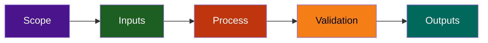

# Automation Scripts

Production-grade scripts for automated issue and PR label management at scale.

## Directory Structure

```
scripts/automation/
├── README.md (this file)
├── label-orchestrator.js          # Unified CLI coordinator
├── sync-pr-labels.js              # Sync PR-related labels
├── manage-stale-issues.js         # Mark inactive issues
├── review-meta-labels.js          # Audit meta labels
├── review-status-labels.js        # Audit status labels
├── includes/                       # Shared utilities
│   ├── label-management.js        # Label API operations
│   ├── report-generator.js        # Report formatting
│   └── activity-analyzer.js       # Issue activity analysis
└── __tests__/                      # Unit tests
    ├── *.test.js files
    └── coverage reports
```

## Scripts Overview

### Main Orchestrator

**label-orchestrator.js** — Unified CLI coordinator  
Modes: `audit`, `sync`, `stale`  
Purpose: Coordinate all label management operations  
Usage: `node label-orchestrator.js [mode] [options]`

### Core Scripts

| Script | Purpose | Schedule | Options |
|--------|---------|----------|---------|
| `sync-pr-labels.js` | Sync `meta:has-pr` labels | Daily via workflow | `--dry-run`, `--verbose` |
| `manage-stale-issues.js` | Mark inactive issues | Daily via workflow | `--days`, `--dry-run`, `--verbose` |
| `review-meta-labels.js` | Audit meta label coverage | Monthly via workflow | `--format`, `-o`, `--verbose` |
| `review-status-labels.js` | Audit status label distribution | Monthly via workflow | `--format`, `-o`, `--verbose` |

### Shared Utilities

Located in `includes/`:

**label-management.js**  

- `addLabel(issueNumber, label)` — Add label to issue
- `removeLabel(issueNumber, label)` — Remove label from issue
- `hasLabel(issueNumber, label)` — Check if issue has label
- `fetchIssuesWithLabel(label)` — Get all issues with label

**report-generator.js**  

- `generateJSON(data)` — Format data as JSON
- `generateCSV(data)` — Format data as CSV
- `generateMarkdown(data)` — Format data as Markdown

**activity-analyzer.js**  

- `getLastActivityDate(issue)` — Get last activity timestamp
- `getDaysSinceActivity(issue)` — Calculate days inactive
- `isStale(issue, thresholdDays)` — Check if stale

## Quick Start

### Installation

```bash
# Install dependencies
npm ci

# Verify scripts are executable
ls -l scripts/automation/*.js
```

### First Run

```bash
# Audit current label coverage (read-only)
node label-orchestrator.js audit --all --verbose

# Preview stale marking (dry-run)
node manage-stale-issues.js --days 30 --dry-run --verbose

# Preview PR label sync (dry-run)
node sync-pr-labels.js --dry-run --verbose
```

### Production Use

```bash
# Apply changes (after testing with --dry-run)
node manage-stale-issues.js --days 30 --verbose
node sync-pr-labels.js --verbose

# Generate audit report
node label-orchestrator.js audit --all --format markdown -o audit.md
```

## Testing

All scripts include comprehensive unit tests.

```bash
# Run all automation tests
npm test -- scripts/automation/__tests__/

# Run specific script tests
npm test -- manage-stale-issues.test.js
npm test -- sync-pr-labels.test.js

# Run with coverage
npm test -- --coverage scripts/automation/
```

## Configuration

### GitHub API

Scripts use environment variable:

```bash
export GITHUB_TOKEN=ghp_xxxx...
```

### Repository Target

Hardcoded for safety (prevents accidental cross-repo operations):

```
Owner: lightspeedwp
Repo: .github
```

### Customization

To modify configuration, edit the constants at top of each script:

- `OWNER` — GitHub organization
- `REPO` — Repository name
- Thresholds and exclusion rules

## Workflow Integration

Scripts are integrated into GitHub Actions workflows:

**meta-labels-sync.yml** — Daily at 3 AM UTC

- Runs: sync-pr-labels.js + manage-stale-issues.js
- Triggered: Scheduled + manual dispatch

**label-audit-report.yml** — Monthly on 1st at 4 AM UTC

- Runs: review-meta-labels.js + review-status-labels.js
- Triggered: Scheduled + manual dispatch
- Output: Saved to `.github/reports/audits/`

## Performance

Typical execution times for 350+ issues:

| Script | Time | API Calls |
|--------|------|-----------|
| sync-pr-labels.js | 30-45s | ~50 (paginated) |
| manage-stale-issues.js | 20-30s | ~50 (paginated) |
| review-meta-labels.js | 15-20s | ~30 (paginated) |
| review-status-labels.js | 15-20s | ~30 (paginated) |
| **Full audit** | **1-2 min** | **~160 total** |

## Monitoring

### Success Indicators

- Scripts complete without errors
- Expected number of labels added/removed
- No API rate limiting
- Reports generated on schedule

### Failure Indicators

- Exit code 1 (general error) or 2 (config error)
- API errors in logs
- Workflow run failure notifications
- No output artifacts

## Security

### Safety Features

- **Dry-run mode**: Preview all changes before applying
- **Exclusion rules**: Prevent changes to critical issues (epics, in-progress, etc.)
- **Directory validation**: Prevent cross-repo contamination
- **Environment variables**: User inputs passed safely (no command injection)
- **Rate limiting**: Graceful handling of API limits
- **Immutable logs**: All changes are logged

### Access Control

Scripts only have permissions for:

- Read: Issues, PRs, labels
- Write: Labels only (no issue closure, no content changes)

## Debugging

Enable verbose logging:

```bash
# All scripts support --verbose
node manage-stale-issues.js --verbose
node sync-pr-labels.js --verbose
node label-orchestrator.js audit --all --verbose
```

Check logs in:

```
.github/reports/     # Audit reports
.github/logs/        # Workflow logs (GitHub Actions)
```

## Examples

### Example 1: Audit Current State

```bash
# See what needs attention
node label-orchestrator.js audit --all --format markdown

# See specific details
node review-meta-labels.js --format json
```

### Example 2: Test Before Applying

```bash
# Test 14-day stale threshold
node manage-stale-issues.js --days 14 --dry-run --verbose

# If output looks good, apply it
node manage-stale-issues.js --days 14 --verbose
```

### Example 3: Generate Report

```bash
# Monthly audit report
node label-orchestrator.js audit --all --format markdown -o audit-2026-08.md

# Share the report
git add audit-2026-08.md
git commit -m "docs: Monthly label audit (2026-08)"
```

## Related Documentation

- [ISSUE_MAINTENANCE_SCRIPTS.md](../../docs/ISSUE_MAINTENANCE_SCRIPTS.md) — Full system guide
- [LABEL_MANAGEMENT_CLI.md](../../docs/LABEL_MANAGEMENT_CLI.md) — CLI reference
- [GitHub Workflows](../../.github/workflows/meta-labels-sync.yml) — Scheduled automation
- [Phase 4 Issue #1771](https://github.com/lightspeedwp/.github/issues/1771) — Documentation tracking

---

*Last updated: 2026-08-11 | Part of Issue Maintenance Scripts Phase 1-4 delivery*

## Repository Flow


