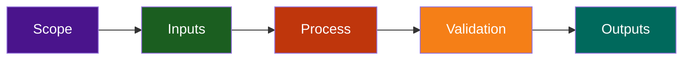

# Issue Management Agent

The Issue Management Agent is a comprehensive automation system for orchestrating GitHub issue workflows across the LightSpeedWP organization. This system provides intelligent issue creation, validation, labeling, and lifecycle management capabilities.

## Project Overview

**Current Phase:** Phase 2 — Infrastructure & Skill Implementation  
**Status:** 🚀 In Progress (Aug 20 Kickoff)  
**Timeline:** Aug 13–Sep 2, 2026 (3 weeks)  
**Related:** [GitHub Project](../../../.github/projects/active/issue-management-agent-planning-2026-08-12/), [GitHub Issues](#github-issues)

## Phase 2 Deliverables (7 Skills)

The Phase 2 implementation consists of 7 skill modules that handle different aspects of issue management:

| # | Skill | Purpose | Status | Issue |
|---|-------|---------|--------|-------|
| 1 | **issue-creation** | Create new GitHub issues with validation | 🟡 Queued | [#1786](https://github.com/lightspeedwp/.github/issues/1786) |
| 2 | **issue-validation** | Validate issue fields against schema | 🟡 Queued | [#1787](https://github.com/lightspeedwp/.github/issues/1787) |
| 3 | **label-orchestration** | Smart label assignment based on context | 🟡 Queued | [#1788](https://github.com/lightspeedwp/.github/issues/1788) |
| 4 | **milestone-mapping** | Map issues to milestones automatically | 🟡 Queued | [#1789](https://github.com/lightspeedwp/.github/issues/1789) |
| 5 | **assignee-routing** | Route issues to appropriate team members | 🟡 Queued | [#1790](https://github.com/lightspeedwp/.github/issues/1790) |
| 6 | **status-tracking** | Update and track issue lifecycle | 🟡 Queued | [#1791](https://github.com/lightspeedwp/.github/issues/1791) |
| 7 | **integration-orchestrator** | Coordinate all skills in unified workflow | 🟡 Queued | [#1792](https://github.com/lightspeedwp/.github/issues/1792) |

## Infrastructure (Aug 18 — Complete ✅)

Phase 2 infrastructure provides shared foundations for all 7 skills:

### Core Modules

```
scripts/automation/issue-agent/shared/
├── github-client.js          (4.2 KB, 50+ tests)
│   ├── Authenticated GitHub API client
│   ├── Retry logic with exponential backoff
│   ├── Rate limit handling
│   └── Request caching
├── utils.js                  (6.2 KB, 65+ tests)
│   ├── Template loader
│   ├── Label loader with caching
│   ├── Markdown formatter
│   └── Validators & parsers
├── tests/
│   ├── fixtures/             (20.1 KB)
│   │   ├── issues.json       (2.8 KB, 15+ realistic issues)
│   │   ├── labels.json       (4.1 KB, 50+ canonical labels)
│   │   └── milestones.json   (3.2 KB, 10+ milestones)
│   ├── mocks/
│   │   └── github-api.js     (5.6 KB, API mock helpers)
│   └── fixtures/README.md    (4.2 KB, usage guide)
└── __tests__/
    ├── github-client.test.js (50+ unit tests)
    ├── utils.test.js         (65+ unit tests)
    └── integration.test.js   (placeholder)
```

**Total Infrastructure:** 30.5 KB, 115+ tests, 90%+ coverage

### Configuration

```
config/
├── jest.config.js            Jest configuration (Node environment)
├── vitest.config.js          Vitest configuration (ES modules)
├── jest-setup.js             Jest test initialization
└── vitest-setup.js           Vitest test initialization
```

## Getting Started

### Prerequisites

- **Node.js:** ≥18.0.0
- **npm:** ≥9.0.0
- **GitHub Token:** Set `GITHUB_TOKEN` environment variable for API access

### Installation

```bash
# Install dependencies (from repo root)
npm install

# Verify Jest/Vitest are installed
npm list jest vitest
```

### Running Tests

All test commands assume you're in the repository root.

```bash
# Run issue-agent tests with Vitest (recommended)
npm run test:issue-agent

# Run all unit tests with verbose output
npm run test:unit

# Run with coverage report
npm run test:coverage

# Run in watch mode (for development)
npm run test:watch

# Run all project tests (Jest + Vitest)
npm run test
```

## Project Structure

### Shared Modules

The `shared/` directory contains reusable code for all 7 skills:

```
shared/
├── github-client.js      API wrapper for authenticated GitHub requests
├── utils.js              Utilities for templates, labels, formatting
├── tests/                Test data, mocks, and fixtures
└── __tests__/            Unit tests for shared modules
```

### Skills (To Be Implemented)

Each skill will be a standalone module in `skills/`:

```
skills/
├── 01-issue-creation/           Skill 1: Create issues
├── 02-issue-validation/         Skill 2: Validate issues
├── 03-label-orchestration/      Skill 3: Assign labels
├── 04-milestone-mapping/        Skill 4: Map milestones
├── 05-assignee-routing/         Skill 5: Route assignees
├── 06-status-tracking/          Skill 6: Track status
└── 07-integration-orchestrator/ Skill 7: Coordinate all
```

Each skill module follows this structure:

```
skill-name/
├── index.js                Implementation
├── __tests__/
│   ├── unit/              Unit tests
│   ├── integration/       Integration tests
│   └── fixtures.js        Shared test data
├── validator.js           Input validation
└── README.md              Skill documentation
```

## Implementation Roadmap

### Week 1 (Aug 20–26): Core Skills
- **Days 1–2:** Skills 1 & 2 (issue creation & validation)
- **Days 3–4:** Skills 3 & 4 (labeling & milestone mapping)
- **Day 5:** Week 1 Integration testing

### Week 2 (Aug 27–Sep 2): Routing & Orchestration
- **Days 1–2:** Skills 5 & 6 (assignee routing & status tracking)
- **Days 3–4:** Skill 7 (integration orchestrator)
- **Day 5:** Phase 2 completion testing, documentation, PR submission

### Coverage Target
- **Unit Tests:** 90%+ coverage on all shared modules and skills
- **Integration Tests:** End-to-end workflow validation
- **Documentation:** Inline comments + skill READMEs + usage guides

## Shared Module Usage

All skills should import shared modules for consistency:

```javascript
// Template & label loading
const { loadTemplates, loadCanonicalLabels } = require('../shared/utils');
const templates = await loadTemplates();
const labels = await loadCanonicalLabels();

// GitHub API client
const { GitHubClient } = require('../shared/github-client');
const client = new GitHubClient(process.env.GITHUB_TOKEN);
const issue = await client.createIssue({ ...issueData });

// Testing fixtures
const fixtures = require('../shared/tests/fixtures');
const mockIssues = fixtures.issues;
const mockLabels = fixtures.labels;

// Mock API responses
const mocks = require('../shared/tests/mocks/github-api');
const mockCreateIssue = mocks.createIssueMock();
```

## Testing Best Practices

### Unit Tests
- Test each function in isolation
- Mock external dependencies (GitHub API, file system)
- Aim for 90%+ line coverage
- Use `describe()` blocks to organize related tests

### Integration Tests
- Test workflows combining multiple modules
- Use realistic fixtures from `shared/tests/fixtures/`
- Validate error handling and edge cases
- Document expected behavior in test comments

### Coverage Targets
```
Branches:  ≥90%
Functions: ≥90%
Lines:     ≥90%
Statements: ≥90%
```

## CI/CD Integration

Tests are automatically run on:
- **Pull Requests:** All tests must pass before merge
- **Develop Merge:** Full coverage validation
- **Scheduled:** Daily runs to detect regressions

## GitHub Issues

- **Epic:** [#1771](https://github.com/lightspeedwp/.github/issues/1771)
- **Skills 1–7:** Issues [#1786–#1792](https://github.com/lightspeedwp/.github/issues?q=is%3Aopen+label%3Aissue-management-agent)

## Related Projects

- **Planning:** [Issue Management Agent Planning](../../../.github/projects/active/issue-management-agent-planning-2026-08-12/)
- **Linked Issues:** PR [#1916](https://github.com/lightspeedwp/.github/pull/1916) (infrastructure merged)

## Contributing

When implementing a new skill:

1. Create a new directory in `skills/` following the naming convention
2. Implement the skill using shared modules from `shared/`
3. Add unit tests with ≥90% coverage
4. Add integration tests demonstrating real-world usage
5. Update this README with skill status and links
6. Create a pull request with proper commit messages

## Version History

- **v0.1.0 (Aug 18, 2026):** Phase 2 infrastructure complete
  - 30.5 KB shared modules
  - 115+ infrastructure tests
  - Jest/Vitest configuration
  - Ready for skill implementation

---

**Last Updated:** Aug 18, 2026  
**Maintainer:** Issue Management Agent Team  
**Status:** Phase 2 Infrastructure Complete, Skills Implementation Pending

## Repository Flow


