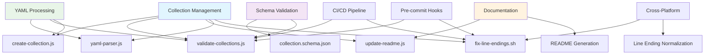
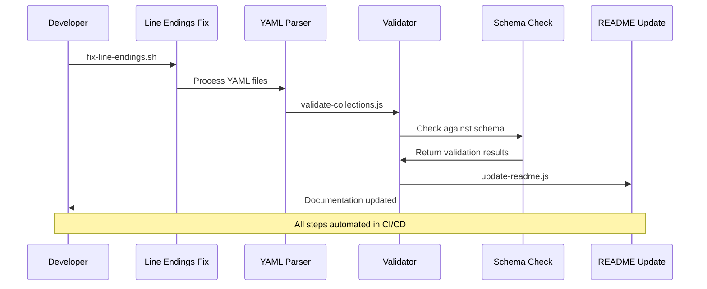

## 🎯 Awesome Copilot Scripts & Utilities

This directory contains core utilities for managing, validating, and maintaining the Awesome Copilot prompt and collection system in the LightSpeedWP .github repository.

## 📊 Script Dependencies & Flow

## Main Scripts

- **`create-collection.js`**
  - Creates new prompt collection files from templates or user input.
  - Used by: Maintainers when adding new prompt collections.

- **`fix-line-endings.sh`**
  - Normalises line endings in all prompt and collection files for cross-platform consistency.
  - Used by: All scripts that read/write prompt or collection files (pre-commit, CI, manual runs).

- **`update-readme.js`**
  - Generates or updates README files for Awesome Copilot collections and script folders.
  - Used by: Maintainers to keep documentation up to date; called by other scripts after changes.

- **`validate-collections.js`**
  - Validates the structure and schema of all prompt collection files against `schemas/collection.schema.json`.
  - Used by: CI, pre-commit hooks, and maintainers before merging changes.

- **`yaml-parser.js`**
  - Utility for parsing and validating YAML frontmatter in prompt and collection files.
  - Used by: `validate-collections.js`, `create-collection.js`, and any script that processes YAML frontmatter.

## How These Scripts Work Together

- `validate-collections.js` and `create-collection.js` both depend on `yaml-parser.js` for robust YAML handling.
- `fix-line-endings.sh` should be run before validation or collection creation to avoid cross-platform issues.
- `update-readme.js` is used to keep documentation current after any structural or content changes in collections or scripts.
- All scripts are designed to be modular and reusable in CI, pre-commit hooks, or manual workflows.

## Related Script Folders

- **`includes/`** — Shared shell and Bats helpers for test automation. Used by maintenance, utility, and validation scripts across the repo.
- **`utility/`** — General-purpose shell and Node.js utilities for label management, logging, and validation. Some label and logging scripts are used by Copilot and maintenance scripts.
- **`maintenance/`** — Automation for updating, validating, and generating `README.md` and `CHANGELOG.md` files. Scripts here often call or are called by `awesome-copilot` scripts for documentation consistency.
- **`json-validation/`** — Scripts for validating JSON and YAML files, used by `validate-collections.js` and other schema-related tools.

## Subfolders

If present, subfolders may contain:

- Additional prompt collections (see `collections/`)
- Test data or fixtures for validation
- Extended utilities for prompt management

Each subfolder should include its own `README.md` describing its contents and relationship to the main scripts above.

## Contribution & Standards

- All scripts must follow the [LightSpeedWP Coding Standards](../../.github/instructions/coding-standards.instructions.md).
- See [CONTRIBUTING.md](../../CONTRIBUTING.md) for contribution guidelines.
- For prompt and collection schema, see [`schemas/collection.schema.json`](../../schemas/collection.schema.json).

## 🔄 Collection Validation Workflow

---

## 📚 References

### 🔗 Documentation Links

- [Awesome Copilot Collections](../../.github/prompts/awesome-copilot/)
- [Collection Schema Definition](../../schemas/collection.schema.json)
- [LightSpeedWP Coding Standards](../../.github/instructions/coding-standards.instructions.md)
- [Contributing Guidelines](../../CONTRIBUTING.md)

### 🛠️ Development Resources

- [Shared Includes Directory](../includes/)
- [Utility Scripts](../utility/)
- [Maintenance Scripts](../maintenance/)
- [JSON Validation](../json-validation/)

### 🎯 AI & Automation

- [Custom Instructions](../../.github/custom-instructions.md)
- [Prompts Library](../../.github/prompts/prompts.md)
- [Agents Documentation](../../.github/agents/agent.md)
- [Chatmodes Index](../../.github/chatmodes/chatmodes.md)

## License

GPL v3. See [LICENSE](../../LICENSE).

---

_🤖 Streamlining prompt collection management through intelligent automation._
