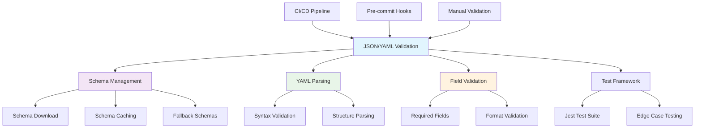
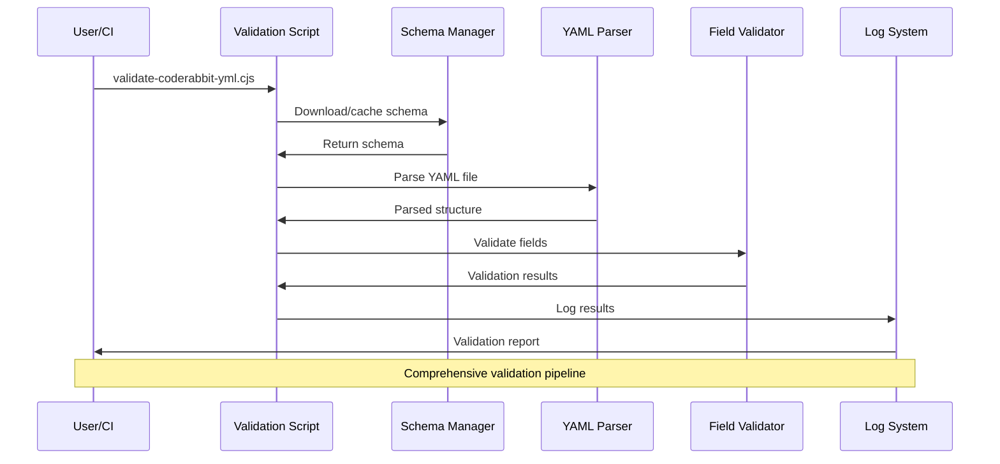

## 🔍 JSON & YAML Validation Scripts


This directory contains utilities for validating JSON and YAML configuration files used throughout the LightSpeedWP project.

## 📊 Validation Architecture



## Main Scripts

- **`validate-json.js`**
  - Comprehensive JSON linting and validation tool
  - Features: Prettier formatting, JSONLint syntax checking, Ajv schema validation
  - Supports glob patterns, multiple files, and various JSON Schema drafts
  - Produces actionable reports and minimal diffs
  - Used by: CI/CD pipelines, pre-commit hooks, and manual validation workflows

- **`validate-coderabbit-yml.cjs`**
  - Validates `.coderabbit.yml` configuration files for proper YAML syntax and required fields.
  - Fetches and validates against the official CodeRabbit schema.
  - Used by: CI/CD pipelines, pre-commit hooks, and manual validation workflows.

## Test Files

- **`validate-coderabbit-yml.test.js`** — Jest test suite for the CodeRabbit YAML validator.
- **`**tests**/validate-coderabbit-yml.test.js`** — Additional test cases and edge case validation.

## How This Works

### JSON Validation Pipeline

The `validate-json.js` script follows this workflow:

1. **File Discovery**: Find JSON files matching glob pattern (excluding `node_modules`, `package-lock.json`, etc.)
2. **Formatting (Optional)**: Pretty-print JSON with Prettier (can be skipped with `--validate-only`)
3. **Syntax Validation (Optional)**: Strict syntax checking with JSONLint (enabled with `--strict`)
4. **Schema Validation (Optional)**: Validate against JSON Schema using Ajv (if `--schema` is provided)
5. **Reporting**: Generate comprehensive reports with minimal diffs and actionable fixes
6. **Exit Status**: Exit with code 1 if any validation fails (suitable for CI/CD)

### YAML Validation (CodeRabbit)

The validation scripts in this directory:

1. **Schema Validation**: Download and cache the latest schema from CodeRabbit's official source
2. **YAML Parsing**: Parse YAML files and validate syntax
3. **Field Validation**: Ensure all required fields are present and properly formatted
4. **Logging**: Comprehensive logging to `logs/` directory for debugging and audit trails

## Usage Examples

### JSON Validation & Linting

```bash
# Format all JSON files (read-only check)
node scripts/json-validation/validate-json.js --format-only --read-only

# Format all JSON files (in place)
node scripts/json-validation/validate-json.js --format-only

# Validate syntax only (strict mode with JSONLint)
node scripts/json-validation/validate-json.js --validate-only --strict

# Validate against a schema
node scripts/json-validation/validate-json.js \
  --glob "data/**/*.json" \
  --schema "schema/my-doc.schema.json" \
  --spec draft2020

# Comprehensive validation (format + validate + schema)
node scripts/json-validation/validate-json.js \
  --glob "**/*.json" \
  --schema "schema/my-doc.schema.json" \
  --strict

# Read-only validation (no modifications)
node scripts/json-validation/validate-json.js \
  --glob "**/*.json" \
  --read-only \
  --strict

# Using npm scripts
npm run format:json              # Format all JSON files
npm run lint:json                # Validate syntax (strict mode)
npm run validate:json:schemas    # Validate schema files
npm run validate:json:all        # Comprehensive validation
```

### Validate CodeRabbit Configuration

```bash
# Validate the main .coderabbit.yml file
node scripts/json-validation/validate-coderabbit-yml.cjs

# Run tests
npm test -- scripts/json-validation/validate-coderabbit-yml.test.js
```

### Common Workflows

```bash
# Format and validate a specific directory
npx prettier --write "config/**/*.json"
node scripts/json-validation/validate-json.js \
  --glob "config/**/*.json" \
  --validate-only --strict

# Validate against multiple schemas (using Ajv directly)
npx ajv validate \
  -s schema/my-doc.schema.json \
  -d "data/**/*.json" \
  --spec=draft2020 \
  --errors=text

# Machine-readable error report
npx ajv validate \
  -s schema/my-doc.schema.json \
  -d "data/**/*.json" \
  --spec=draft2020 \
  --errors=json > reports/ajv-errors.json
```

## Integration with Other Scripts

- **`maintenance/`** — Maintenance scripts use these validators to ensure configuration integrity
- **`includes/validation.sh`** — Shared validation helpers that may call these Node.js validators
- **CI/CD Workflows** — Automated validation as part of the build and deployment process

## Schema Management

- Schemas are automatically downloaded and cached in `schemas/` directory
- Local schema files are used as fallback when remote schemas are unavailable
- Schema validation ensures configuration files meet current standards

## Dependencies

- **Node.js** (>=18.0.0) — Required for running the JavaScript validation scripts
- **Prettier** (^3.0.0) — JSON formatting and pretty-printing
- **Ajv** (^8.17.1) — JSON Schema validation (supports Draft 7, 2019-09, 2020-12, JTD)
- **Ajv-CLI** (^5.0.0) — Command-line interface for Ajv
- **Ajv-Formats** (^3.0.1) — Additional format validators for Ajv
- **glob** (^10.3.12) — File pattern matching
- **js-yaml** (^4.1.1) — YAML parsing and validation
- **JSONLint** (optional) — Strict JSON syntax validation

## Contributing

- All validation scripts must follow [LightSpeedWP Coding Standards](../../.github/instructions/coding-standards.instructions.md)
- Add tests for any new validation functionality
- Update schema paths and URLs as needed for new configuration types
- See [CONTRIBUTING.md](../../CONTRIBUTING.md) for contribution guidelines

## 🔄 Validation Process Flow



---

## 📚 References

### 🔗 Documentation Links

- [LightSpeedWP Main Repository](https://github.com/lightspeedwp/.github)
- [CodeRabbit Documentation](https://docs.coderabbit.ai/)
- [YAML Specification](https://yaml.org/spec/)
- [JSON Schema Documentation](https://json-schema.org/)

### 🛠️ Development Resources

- [Schema Definitions Directory](../../schemas/)
- [Shared Includes Directory](../includes/)
- [Quality Assurance](../../.github/instructions/quality-assurance.instructions.md)
- [Node.js Package Configuration](../../package.json)

### 🎯 AI & Automation

- [Custom Instructions](../../.github/custom-instructions.md)
- [GitHub Actions Workflows](../../.github/workflows/)
- [Contributing Guidelines](../../CONTRIBUTING.md)
- [Coding Standards](../../.github/instructions/coding-standards.instructions.md)

## License

GPL v3. See [LICENSE](../../LICENSE).

---

*✅ Ensuring configuration integrity through automated validation and schema compliance.*
