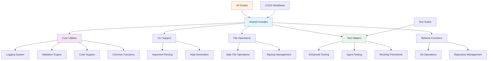
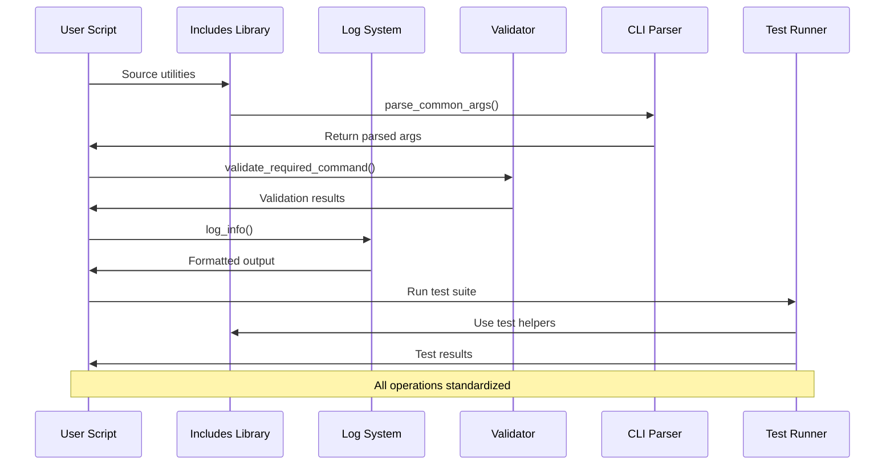

## 🛠️ Shared Utilities & Test Helpers


This directory contains reusable shell functions, utilities, and test helpers used across all LightSpeed WP scripts and test suites.

## 📊 Utilities Architecture



## Directory Structure

```text
scripts/includes/
├── README.md                    # This file
├── enhanced-test-helpers.bash   # Enhanced test utilities
├── agent-test-helpers.bash      # Agent-specific test helpers
├── cli-utils.sh                 # CLI argument parsing utilities
├── colors.sh                    # Terminal color support
├── common-functions.sh          # General-purpose shell functions
├── file-operations.sh           # File system operations
├── logging.sh                   # Standardized logging functions
├── validation.sh                # Input validation utilities
├── __tests__/                   # Tests for the helper functions
├── cli/
│   └── cli-utils.sh            # CLI utilities (alternative location)
├── core/
│   ├── colors.sh               # Core color functions
│   ├── common-functions.sh     # Core shared functions
│   ├── logging.sh              # Core logging functions
│   └── validation.sh           # Core validation functions
├── filesystem/
│   └── file-operations.sh      # File system utilities
└── network/
    └── git-functions.sh        # Git-related operations
```

## Core Utilities

### Command Line Interface (`cli-utils.sh`)

Standardized argument parsing and help generation for all scripts:

- **parse_common_args()** — Parse standard arguments (--verbose, --dry-run, --help)
- **show_standard_help()** — Generate consistent help output
- **validate_arguments()** — Validate required arguments and options

### Logging System (`logging.sh`)

Consistent logging across all scripts with color support:

- **log_info()**, **log_warn()**, **log_error()** — Structured logging functions
- **log_debug()** — Debug output (when VERBOSE is enabled)
- **log_success()** — Success message formatting

### Input Validation (`validation.sh`)

Common validation functions for scripts:

- **validate_required_command()** — Check if required commands exist
- **validate_file_exists()** — Verify file existence
- **validate_directory_exists()** — Verify directory existence
- **validate_url()** — URL format validation

### Color Support (`colors.sh`)

Terminal color constants and functions:

- Color constants (RED, GREEN, YELLOW, BLUE, etc.)
- **colorize()** — Apply colors to text output
- **has_color_support()** — Detect terminal color capability

### File Operations (`file-operations.sh`)

Safe file system operations:

- **backup_file()** — Create file backups before modification
- **safe_write()** — Atomic file writing operations
- **cleanup_temp_files()** — Temporary file management

### Common Functions (`common-functions.sh`)

General-purpose utility functions:

- **get_repo_root()** — Find repository root directory
- **is_git_repo()** — Check if current directory is a Git repository
- **get_script_dir()** — Get the directory of the calling script

## Test Helpers

### Enhanced Test Helpers (`enhanced-test-helpers.bash`)

Extended Bats testing utilities with advanced capabilities:

- **setup_enhanced_test_environment()** — Enhanced test environment setup
- **cleanup_enhanced_test_environment()** — Enhanced cleanup procedures
- **source_includes()** — Load all include files safely

**Mocking Functions:**

- **mock_git_command()** — Mock specific git commands
- **create_test_git_repo()** — Create test git repository
- **create_test_script()** — Create test script with includes

**Assertion Functions:**

- **assert_log_contains()** — Assert log contains message
- **assert_function_exists()** — Assert function is defined
- **assert_script_follows_standards()** — Validate script standards
- **assert_no_shellcheck_errors()** — Validate with ShellCheck

**Utility Functions:**

- **run_with_timeout()** — Run command with timeout
- **create_fixture_file()** — Create test fixture
- **load_fixture()** — Load fixture content

### Agent Test Helpers (`agent-test-helpers.bash`)

Specialized helpers for testing LightSpeed WP agents:

**Agent Environment:**

- **setup_agent_test_environment()** — Setup for agent testing
- **cleanup_agent_test_environment()** — Agent-specific cleanup

**GitHub Mocking:**

- **create_mock_github_event()** — Mock GitHub webhook events
- **mock_github_api()** — Mock GitHub API responses
- **create_mock_github_response()** — Create API response files

**Agent Validation:**

- **validate_agent_structure()** — Validate agent file structure
- **validate_js_agent_structure()** — Validate JavaScript agents
- **assert_agent_follows_standards()** — Comprehensive agent validation

**Agent Testing:**

- **run_agent_test()** — Run agent with test parameters
- **test_agent_dry_run()** — Test agent in dry-run mode

## Usage Examples

### Basic Script Template

```bash
#!/bin/bash
# Load shared utilities
source "$(dirname "$0")/../includes/core/logging.sh"
source "$(dirname "$0")/../includes/core/validation.sh"
source "$(dirname "$0")/../includes/cli/cli-utils.sh"

# Parse arguments and setup
parse_common_args "$@"
validate_required_command "git"

# Use logging functions
log_info "Starting script execution"
log_debug "Debug information"
log_success "Operation completed"
```

### Test Template

```bash
#!/usr/bin/env bats

load "$(dirname "$BATS_TEST_FILENAME")/../includes/enhanced-test-helpers.bash"

setup() {
    setup_enhanced_test_environment
    source_includes
}

teardown() {
    cleanup_enhanced_test_environment
}

@test "example test with enhanced helpers" {
    run log_info "Test message"
    assert_log_contains "Test message"
    assert_function_exists "log_info"
}
```

## Integration with Scripts

### Sourcing Helpers

All scripts should source the appropriate helpers:

```bash
# Standard pattern for all scripts
SCRIPT_DIR="$(cd "$(dirname "${BASH_SOURCE[0]}")" && pwd)"
INCLUDES_DIR="${SCRIPT_DIR}/../includes"

source "${INCLUDES_DIR}/logging.sh"
source "${INCLUDES_DIR}/validation.sh"
source "${INCLUDES_DIR}/cli-utils.sh"
```

### Error Handling

Use consistent error handling patterns:

```bash
# Validate dependencies
validate_required_command "jq" || exit 1
validate_required_command "curl" || exit 1

# Safe operations
if ! validate_file_exists "$config_file"; then
    log_error "Configuration file not found: $config_file"
    exit 1
fi
```

## Directory Organization

### Core vs. Alternative Locations

Some utilities exist in both root and subdirectory locations:

- **Root files** (`cli-utils.sh`, `logging.sh`) — Primary implementations
- **Subdirectory files** (`core/`, `cli/`) — Alternative or specialized versions
- **Test files** (`__tests__/`) — Test suites for the helpers themselves

### Network Functions

Git and network-related operations are in `network/`:

- **git-functions.sh** — Git repository operations
- Functions for remote repository interactions
- Branch and commit management utilities

## Best Practices

### For Script Authors

1. **Always source required helpers** before using functions
2. **Use consistent error handling** with validation functions
3. **Follow logging patterns** for consistent output
4. **Test with enhanced helpers** for comprehensive coverage

### For Helper Development

1. **Document all functions** with proper headers
2. **Include usage examples** in function comments
3. **Test all helper functions** in `__tests__/` directory
4. **Maintain backward compatibility** when modifying existing functions

## Contributing

When adding new helpers or modifying existing ones:

1. Follow [LightSpeedWP Coding Standards](../../.github/instructions/coding-standards.instructions.md)
2. Add comprehensive tests in `__tests__/` directory
3. Update this README with new function documentation
4. Ensure compatibility with existing scripts
5. Add usage examples for new functionality

## 🔄 Script Integration Workflow



---

## 📚 References

### 🔗 Documentation Links

- [Main Scripts Directory](../README.md)
- [LightSpeedWP Coding Standards](../../.github/instructions/coding-standards.instructions.md)
- [Testing Guidelines](../../.github/instructions/tests.instructions.md)
- [Shell Script Linting](../../.github/instructions/linting/linting-shell.instructions.md)

### 🛠️ Development Resources

- [Maintenance Scripts](../maintenance/)
- [Utility Scripts](../utility/)
- [Validation Scripts](../validation/)
- [Test Coverage Reports](../../tests/TEST_COVERAGE_SUMMARY.md)

### 🎯 AI & Automation

- [Custom Instructions](../../.github/custom-instructions.md)
- [Agents Documentation](../../.github/agents/agent.md)
- [Workflow Automation](../../.github/workflows/)
- [Contributing Guidelines](../../CONTRIBUTING.md)

---

*🔧 Building robust automation through shared utilities and comprehensive testing.*
