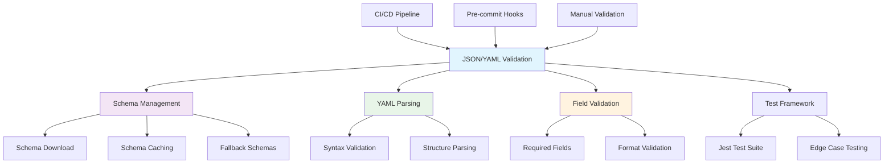
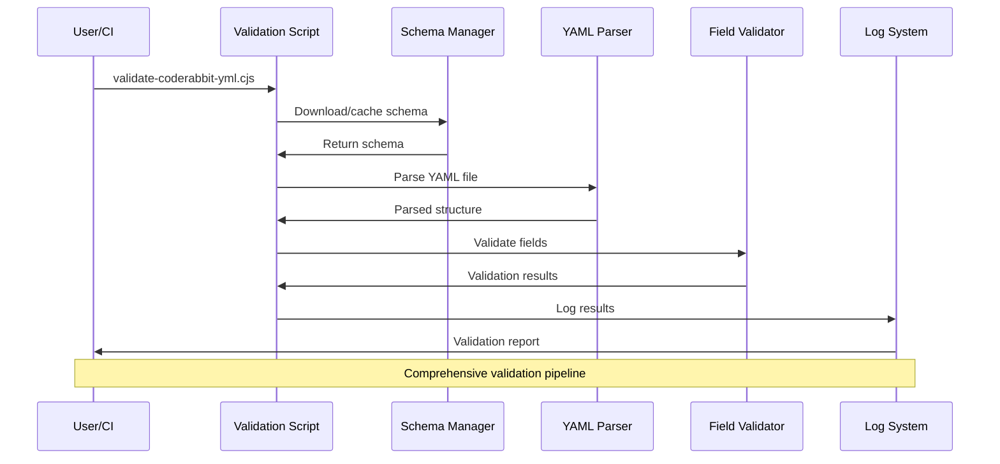

## 🔍 JSON & YAML Validation Scripts


This directory contains utilities for validating JSON and YAML configuration files used throughout the LightSpeedWP project.

## 📊 Validation Architecture



## Main Scripts

- __`validate-coderabbit-yml.cjs`__
  - Validates `.coderabbit.yml` configuration files for proper YAML syntax and required fields.
  - Fetches and validates against the official CodeRabbit schema.
  - Used by: CI/CD pipelines, pre-commit hooks, and manual validation workflows.

## Test Files

- __`validate-coderabbit-yml.test.js`__ — Jest test suite for the CodeRabbit YAML validator.
- __`__tests__/validate-coderabbit-yml.test.js`__ — Additional test cases and edge case validation.

## How This Works

The validation scripts in this directory:

1. __Schema Validation__: Download and cache the latest schema from CodeRabbit's official source
2. __YAML Parsing__: Parse YAML files and validate syntax
3. __Field Validation__: Ensure all required fields are present and properly formatted
4. __Logging__: Comprehensive logging to `logs/` directory for debugging and audit trails

## Usage Examples

### Validate CodeRabbit Configuration

```bash
# Validate the main .coderabbit.yml file
node scripts/json-validation/validate-coderabbit-yml.cjs

# Run tests
npm test -- scripts/json-validation/validate-coderabbit-yml.test.js
```

## Integration with Other Scripts

- __`maintenance/`__ — Maintenance scripts use these validators to ensure configuration integrity
- __`includes/validation.sh`__ — Shared validation helpers that may call these Node.js validators
- __CI/CD Workflows__ — Automated validation as part of the build and deployment process

## Schema Management

- Schemas are automatically downloaded and cached in `schemas/` directory
- Local schema files are used as fallback when remote schemas are unavailable
- Schema validation ensures configuration files meet current standards

## Dependencies

- __Node.js__ — Required for running the JavaScript validation scripts
- __js-yaml__ — YAML parsing and validation
- __JSON Schema__ — Schema validation capabilities

## Contributing

- All validation scripts must follow [LightSpeedWP Coding Standards](../../.github/instructions/coding-standards.instructions.md)
- Add tests for any new validation functionality
- Update schema paths and URLs as needed for new configuration types
- See [CONTRIBUTING.md](../../CONTRIBUTING.md) for contribution guidelines

## 🔄 Validation Process Flow



---

## 📚 References

### 🔗 Documentation Links

- [LightSpeedWP Main Repository](https://github.com/lightspeedwp/.github)
- [CodeRabbit Documentation](https://docs.coderabbit.ai/)
- [YAML Specification](https://yaml.org/spec/)
- [JSON Schema Documentation](https://json-schema.org/)

### 🛠️ Development Resources

- [Schema Definitions Directory](../../schemas/)
- [Shared Includes Directory](../includes/)
- [Testing Guidelines](../../.github/instructions/tests.instructions.md)
- [Node.js Package Configuration](../../package.json)

### 🎯 AI & Automation

- [Custom Instructions](../../.github/custom-instructions.md)
- [GitHub Actions Workflows](../../.github/workflows/)
- [Contributing Guidelines](../../CONTRIBUTING.md)
- [Coding Standards](../../.github/instructions/coding-standards.instructions.md)

## License

GPL v3. See [LICENSE](../../LICENSE).

---

_✅ Ensuring configuration integrity through automated validation and schema compliance._
