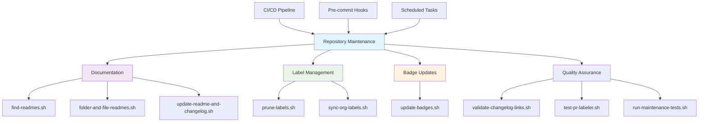
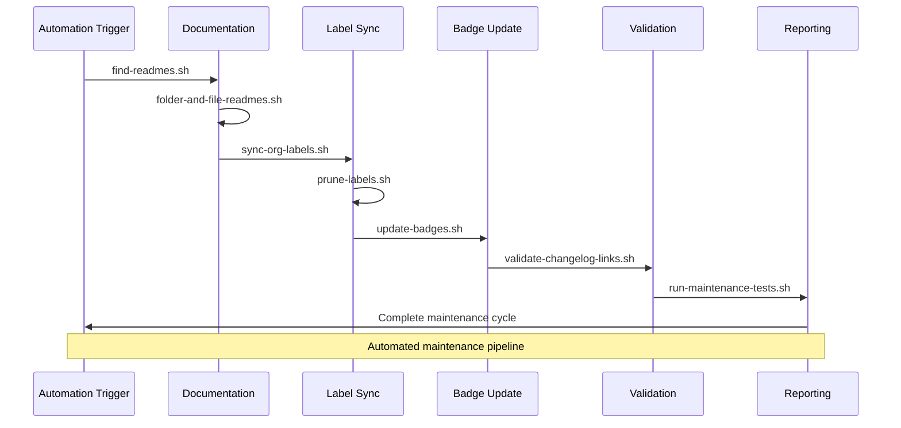

## 🔧 Repository Maintenance Scripts

This directory contains scripts for repository maintenance, automation, and quality assurance. These scripts help enforce standards, keep documentation up-to-date, and streamline common development tasks.

## 📊 Maintenance Workflow

## Scripts Overview

| Script                             | Description                                                                                                       |
| :--------------------------------- | :---------------------------------------------------------------------------------------------------------------- |
| `find-readmes.sh`                  | Finds all README files in the repository.                                                                         |
| `folder-and-file-readmes.sh`       | Generates README files for folders and individual scripts, extracting metadata to create rich documentation.      |
| `prune-labels.sh`                  | Synchronizes repository labels with a canonical source and optionally removes non-standard labels.                |
| `run-maintenance-tests.sh`         | A dedicated test runner for executing all maintenance-related Bats tests.                                         |
| `sync-org-labels.sh`               | Synchronizes GitHub organization labels across all repositories to ensure they conform to a centralized standard. |
| `test-pr-labeler.sh`               | A simple test script to verify the Pull Request (PR) labeler workflow.                                            |
| `tests-folder-and-file-readmes.sh` | A comprehensive Bats test suite for the `folder-and-file-readmes.sh` script.                                      |
| `update-badges.sh`                 | Updates workflow badges in the main `README.md` file for all workflows in the repository.                         |
| `update-readme-and-changelog.sh`   | Ensures all `README.md` files contain a license badge and a link to the `CONTRIBUTING.md` file.                   |
| `validate-changelog-links.sh`      | Validates that all entries in the `[Unreleased]` section of the `CHANGELOG.md` have proper links.                 |

## 🔄 Maintenance Process Flow

---

## 📚 References

### 🔗 Documentation Links

- [LightSpeedWP Main Repository](https://github.com/lightspeedwp/.github)
- [Coding Standards Instructions](../../.github/instructions/coding-standards.instructions.md)
- [Testing Guidelines](../../.github/instructions/tests.instructions.md)
- [Contributing Guidelines](../../CONTRIBUTING.md)

### 🛠️ Development Resources

- [Shared Includes Directory](../includes/)
- [GitHub Actions Workflows](../../.github/workflows/)
- [Organization Labels](../../.github/labels.yml)
- [Changelog Guidelines](../../CHANGELOG.md)

### 🎯 AI & Automation

- [Custom Instructions](../../.github/custom-instructions.md)
- [Agents Documentation](../../.github/agents/agent.md)
- [Prompts Library](../../.github/prompts/prompts.md)
- [Workflow Governance](../../GOVERNANCE.md)

---

_⚙️ Maintaining excellence through automated repository management and quality assurance._
