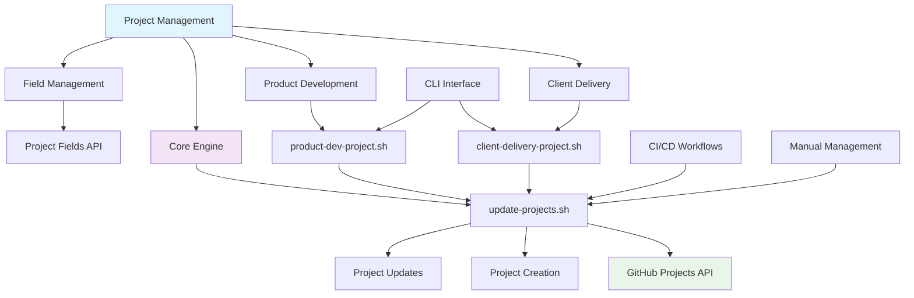
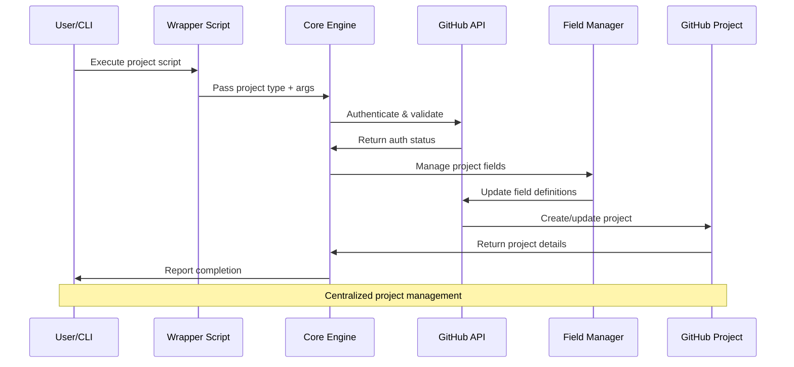

## 📋 GitHub Projects Management Scripts

This directory contains scripts for managing GitHub Projects, including creation, updates, and field management.

## 📊 Project Management Architecture

## Scripts

| Script                                                                         | Description                                                                       |
| ------------------------------------------------------------------------------ | --------------------------------------------------------------------------------- |
| [`client-delivery-project.sh`](./client-delivery-project.sh)                   | A wrapper script to create or update a "Client Delivery" type GitHub project.     |
| [`product-dev-project.sh`](./product-dev-project.sh)                           | A wrapper script to create or update a "Product Development" type GitHub project. |
| [`update-projects.sh`](./update-projects.sh)                                   | The core engine for managing GitHub projects, sourced by the wrapper scripts.     |
| [`README.client-delivery-project.md`](./README.client-delivery-project.md)     | Detailed documentation for the `client-delivery-project.sh` script.               |
| [`README.product-dev-project.md`](./README.product-dev-project.md)             | Detailed documentation for the `product-dev-project.sh` script.                   |
| [`README.update-projects.md`](./README.update-projects.md)                     | Detailed documentation for the core `update-projects.sh` script.                  |
| [`README.test-create-project-field.sh`](./README.test-create-project-field.sh) | Documentation related to the test script for creating project fields.             |

## Architecture

The primary scripts, `client-delivery-project.sh` and `product-dev-project.sh`, are lightweight wrappers that execute the core `update-projects.sh` script. They pass a project-type string ("Client Delivery" or "Product Development") as the first argument, followed by any other arguments they receive.

This architecture centralizes the complex logic in `update-projects.sh` while providing simple, purpose-specific command-line entry points for different project types.

## 🔄 Project Management Workflow

For detailed usage and technical information, please refer to the individual `README.<script-name>.md` files.

---

## 📚 References

### 🔗 Documentation Links

- [Client Delivery Project Documentation](./README.client-delivery-project.md)
- [Product Development Project Documentation](./README.product-dev-project.md)
- [Core Update Projects Documentation](./README.update-projects.md)
- [GitHub Projects API Documentation](https://docs.github.com/en/rest/projects)

### 🛠️ Development Resources

- [Shared Includes Directory](../includes/)
- [GitHub Actions Workflows](../../.github/workflows/)
- [Project Templates](../../.github/PROJECT_TEMPLATE/)
- [Contributing Guidelines](../../CONTRIBUTING.md)

### 🎯 AI & Automation

- [Custom Instructions](../../.github/custom-instructions.md)
- [Agents Documentation](../../.github/agents/agent.md)
- [Coding Standards](../../.github/instructions/coding-standards.instructions.md)
- [Testing Guidelines](../../.github/instructions/tests.instructions.md)

---

*📋 Streamlining project management through automated GitHub Projects integration.*
