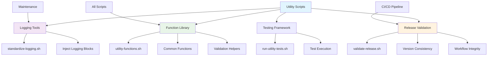
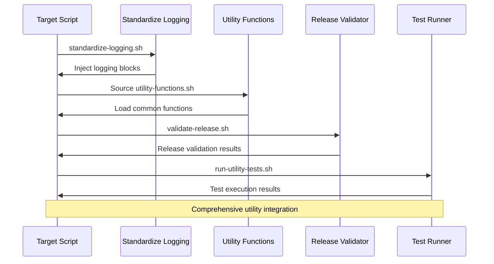

## 🔨 Utility Scripts Collection

This directory contains utility scripts that provide common, reusable functionality or perform repository-wide maintenance tasks.

## 📊 Utility Architecture

## Scripts

| Script                                               | Description                                                                                                                           |
| ---------------------------------------------------- | ------------------------------------------------------------------------------------------------------------------------------------- |
| [`standardize-logging.sh`](./standardize-logging.sh) | A tool to inject a standardized block of logging code into other shell scripts, ensuring consistent output.                           |
| [`utility-functions.sh`](./utility-functions.sh)     | A library of common shell functions for logging, validation, and other tasks. This script is intended to be sourced by other scripts. |
| [`validate-release.sh`](./validate-release.sh)       | A pre-release checklist tool that validates version consistency, workflow integrity, test coverage, and documentation.                |
| [`run-utility-tests.sh`](./run-utility-tests.sh)     | A convenience script for running the Bats tests specific to the utility scripts.                                                      |

## Documentation

Each script has a corresponding `README.<script-name>.md` file that provides detailed information about its purpose, usage, and technical implementation.

- [`README.standardize-logging.md`](./README.standardize-logging.md)
- [`README.utility-functions.md`](./README.utility-functions.md)
- [`README.validate-release.md`](./README.validate-release.md)

## 🔄 Utility Integration Workflow

For detailed usage and technical information, please refer to the individual `README` files.

---

## 📚 References

### 🔗 Documentation Links

- [Standardize Logging Documentation](./README.standardize-logging.md)
- [Utility Functions Documentation](./README.utility-functions.md)
- [Release Validation Documentation](./README.validate-release.md)
- [LightSpeedWP Coding Standards](../../.github/instructions/coding-standards.instructions.md)

### 🛠️ Development Resources

- [Shared Includes Directory](../includes/)
- [Maintenance Scripts](../maintenance/)
- [Test Coverage Reports](../../tests/TEST_COVERAGE_SUMMARY.md)
- [GitHub Actions Workflows](../../.github/workflows/)

### 🎯 AI & Automation

- [Custom Instructions](../../.github/custom-instructions.md)
- [Agents Documentation](../../.github/agents/agent.md)
- [Prompts Library](../../.github/prompts/prompts.md)
- [Contributing Guidelines](../../CONTRIBUTING.md)

---

*🔧 Empowering development through standardized utilities and shared functionality.*
