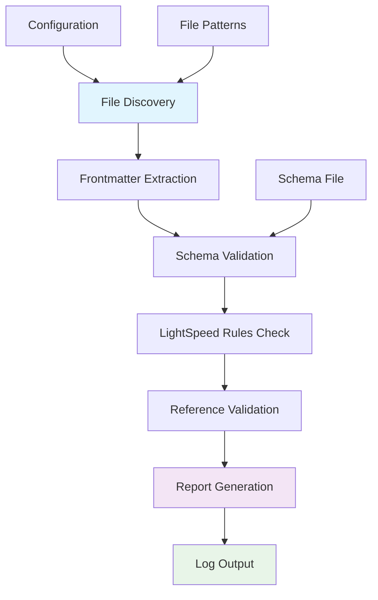
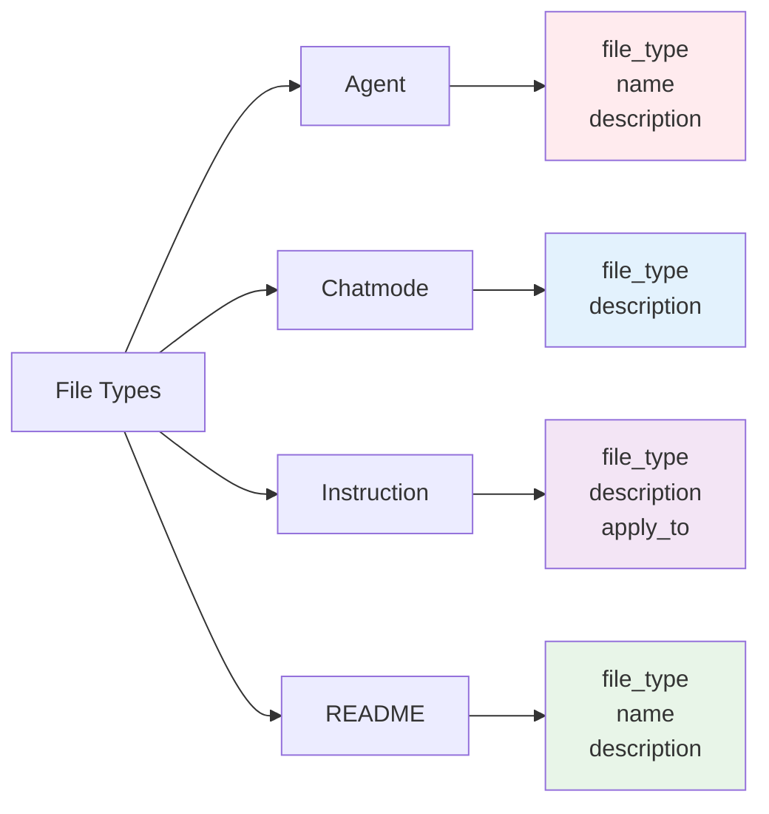
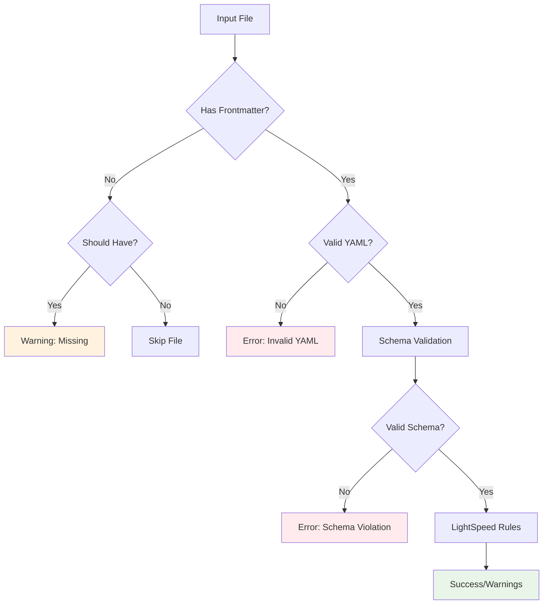

# Frontmatter Validation

This directory contains comprehensive frontmatter validation scripts for the LightSpeedWP .github repository. The validation system ensures all files maintain consistent frontmatter structure according to our established schema and conventions.

## Overview

The frontmatter validation system provides automated checking of YAML frontmatter across all repository files, ensuring compliance with LightSpeed standards and detecting inconsistencies or missing required fields.



## Files

### Core Scripts

- **`validate-frontmatter.js`** - Main validation script with comprehensive frontmatter checking
- **`package.json`** - Dependencies and script configuration
- **`README.md`** - This documentation file

### Test Suite

- **`__tests__/validate-frontmatter.test.js`** - Comprehensive test suite for validation functionality

## Features

### ✅ Schema Validation

- Validates frontmatter against `frontmatter.schema.json`
- Supports all JSON Schema validation features
- Provides detailed error reporting with field-level feedback

### 🔍 File Type Detection

- Automatically detects file types based on path patterns
- Applies type-specific validation rules
- Supports all LightSpeed file types:
  - `agent` - .github/agents/
  - `chatmode` - .github/chatmodes/
  - `instruction` - .github/instructions/
  - `prompt` - .github/prompts/
  - `collection` - .github/collections/
  - `readme` - README.md files
  - `documentation` - General .github/*.md files
  - `template` - Issue/PR/Discussion templates
  - `saved_reply` - Saved reply files

### 📋 Required Fields Validation

- Enforces required fields based on file type
- Validates field presence and non-empty values
- Provides specific recommendations for missing fields

### 💡 Recommended Fields Checking

- Suggests optional but recommended fields
- Helps maintain consistency across files
- Supports best practices enforcement

### 🔗 Reference Validation

- Validates `references` field arrays
- Checks if referenced files exist
- Ensures proper relative path formatting

### 📊 Comprehensive Reporting

- Color-coded console output
- Detailed logging to files
- Statistics summary with counts
- Error categorization (errors, warnings, info)

## Usage

### Basic Validation

```bash
# Run validation with default settings
node validate-frontmatter.js

# Show help information
node validate-frontmatter.js --help
```

### Custom Configuration

```bash
# Use custom schema file
node validate-frontmatter.js --schema ./custom-schema.json

# Specify different root directory
node validate-frontmatter.js --root /path/to/repo

# Custom output log file
node validate-frontmatter.js --output ./validation-results.log
```

### npm Scripts

```bash
# Run validation
npm run validate

# Show help
npm run validate:help

# Run tests
npm test

# Run tests with coverage
npm run test:coverage

# Watch mode for development
npm run test:watch
```

## Configuration

The validation system uses the following default configuration:

```javascript
const CONFIG = {
  schemaPath: '../../schemas/frontmatter.schema.json',
  rootDir: '../..',
  logDir: '../../logs/validation',
  outputFile: '../../logs/validation/frontmatter-validation.log',
  patterns: [
    '**/*.md',
    '**/*.yml', 
    '**/*.yaml',
    '.github/**/*.md',
    '.github/**/*.yml',
    '.github/**/*.yaml'
  ],
  excludePatterns: [
    'node_modules/**',
    '.git/**',
    'coverage/**',
    'logs/**',
    '**/package-lock.json'
  ]
};
```

## Validation Rules

### File Type Requirements



### Recommended Fields by Type

| File Type | Required Fields | Recommended Fields |
|-----------|----------------|-------------------|
| `agent` | file_type, name, description | version, last_updated, owners, tags |
| `chatmode` | file_type, description | tools, model, owners |
| `instruction` | file_type, description, apply_to | owners, tags, version |
| `prompt` | file_type, description | mode, model, tools, tags |
| `collection` | file_type, name, description | version, last_updated, tags |
| `readme` | file_type, name, description | version, last_updated, owners, tags |
| `documentation` | file_type, description | owners, tags, references |

## Output Examples

### Successful Validation

```
[SUCCESS] Valid frontmatter [.github/agents/example.md]
[INFO] Validation completed
  {
    "total": 45,
    "validated": 43,
    "errors": 0,
    "warnings": 2,
    "skipped": 0
  }
```

### Error Detection

```
[ERROR] Invalid frontmatter [.github/agents/broken.md]
  {
    "errors": [
      {
        "instancePath": "/file_type",
        "schemaPath": "#/properties/file_type/enum",
        "keyword": "enum",
        "message": "must be equal to one of the allowed values"
      }
    ]
  }
```

### Warning Examples

```
[WARN] Missing required fields [.github/agents/incomplete.md]
  {
    "fileType": "agent",
    "missingFields": ["name", "description"],
    "recommendation": "Add the following fields: name, description"
  }

[WARN] Referenced file does not exist: non-existent.md [.github/agents/bad-refs.md]
```

## Integration

### Test Suite Integration

The validation script integrates with the repository test suite:

1. **Automated Testing**: Runs as part of CI/CD pipeline
2. **Pre-commit Hooks**: Validates frontmatter before commits
3. **Coverage Reporting**: Generates coverage reports in `../../coverage/validation/`

### Logging Integration

All validation results are logged to:

- **Console**: Color-coded real-time output
- **Log File**: `../../logs/validation/frontmatter-validation.log`
- **Coverage**: Test coverage reports for validation code

## Development

### Running Tests

```bash
# Install dependencies
npm install

# Run all tests
npm test

# Run tests with coverage
npm run test:coverage

# Watch mode for development
npm run test:watch
```

### Adding New Validation Rules

1. **Update Schema**: Modify `../../schemas/frontmatter.schema.json`
2. **Add Type Rules**: Update `getRequiredFieldsByType()` and `getRecommendedFieldsByType()`
3. **Create Tests**: Add test cases in `__tests__/validate-frontmatter.test.js`
4. **Update Documentation**: Reflect changes in this README

### Testing Patterns

The test suite covers:

- ✅ Frontmatter extraction from various formats
- ✅ Schema validation with real and mock schemas
- ✅ File type detection for all supported patterns
- ✅ Required and recommended field validation
- ✅ Reference validation and file existence checking
- ✅ Error handling and edge cases
- ✅ Integration with real LightSpeed frontmatter patterns

## Error Handling

The validation system provides robust error handling:



## Dependencies

- **ajv**: JSON Schema validation
- **ajv-formats**: Additional format validators
- **js-yaml**: YAML parsing and processing
- **glob**: File pattern matching
- **jest**: Testing framework (dev dependency)

## Related Documentation

- [Frontmatter Schema](../../schemas/frontmatter.schema.json)
- [Tagging Conventions](../../.github/instructions/tagging-and-frontmatter-conventions.instructions.md)
- [Mermaid Diagrams](../../.github/instructions/mermaid-diagrams.instructions.md)
- [YAML Documentation](../../docs/YAML.md)
- [Test Coverage Reports](../../coverage/README.md)
