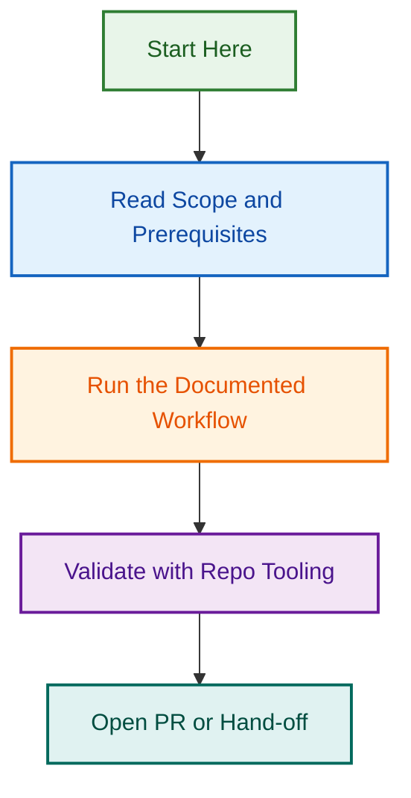

# Markdown Content Validator

<!-- BADGES-START -->
[](https://github.com/lightspeedwp/.github/actions/workflows/changelog-validate.yml)
[](https://github.com/lightspeedwp/.github/actions/workflows/issue-close-label-hygiene.yml)
[](https://github.com/lightspeedwp/.github/actions/workflows/issues.yml)
[](https://github.com/lightspeedwp/.github/actions/workflows/labeling.yml)
[](https://github.com/lightspeedwp/.github/actions/workflows/linting.yml)
[](https://github.com/lightspeedwp/.github/actions/workflows/meta.yml)
[](https://github.com/lightspeedwp/.github/actions/workflows/metrics.yml)
[](https://github.com/lightspeedwp/.github/actions/workflows/planner.yml)
[](https://github.com/lightspeedwp/.github/actions/workflows/project-meta-sync.yml)
[](https://github.com/lightspeedwp/.github/actions/workflows/readme-audit.yml)
[](https://github.com/lightspeedwp/.github/actions/workflows/readme-regen.yml)
[](https://github.com/lightspeedwp/.github/actions/workflows/release.yml)
[](https://github.com/lightspeedwp/.github/actions/workflows/reporting.yml)
[](https://github.com/lightspeedwp/.github/actions/workflows/reviewer.yml)
[](https://github.com/lightspeedwp/.github/actions/workflows/testing.yml)
<!-- BADGES-END -->

This skill validates markdown-oriented content files for:

- markdown structure and formatting quality
- YAML frontmatter presence and schema compliance
- required SemVer version fields
- optional changed-without-version-increment checks
- consolidated markdown reporting

## Run the validator

```bash
python scripts/validate_markdown_content.py \
  --target files \
  --schema references/frontmatter.schema.yaml \
  --report markdown-content-validation-report.md
```

Add `--enforce-version-increment --base-ref main` when you want changed-file version checks.

*Docs signed by 🤖 Copilot for LightSpeedWP – always fresh!*
## Visual Workflow


