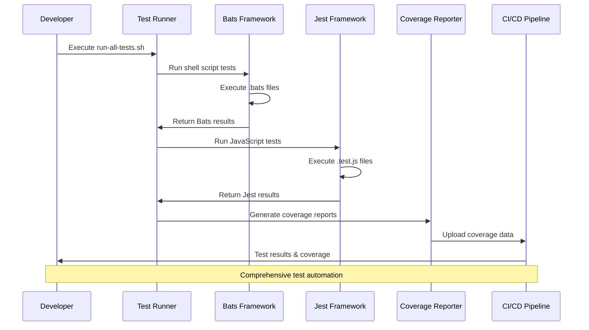
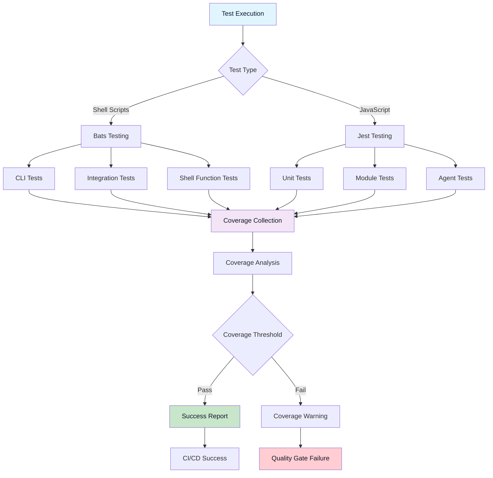

# 🧪 LightSpeedWP Testing Framework

<!-- BADGES-START -->

[](https://github.com/lightspeedwp/.github/actions/workflows/changelog.yml)
[](https://github.com/lightspeedwp/.github/actions/workflows/issues.yml)
[](https://github.com/lightspeedwp/.github/actions/workflows/labeling.yml)
[](https://github.com/lightspeedwp/.github/actions/workflows/linting.yml)
[](https://github.com/lightspeedwp/.github/actions/workflows/meta.yml)
[](https://github.com/lightspeedwp/.github/actions/workflows/metrics.yml)
[](https://github.com/lightspeedwp/.github/actions/workflows/planner.yml)
[](https://github.com/lightspeedwp/.github/actions/workflows/project-meta-sync.yml)
[](https://github.com/lightspeedwp/.github/actions/workflows/release.yml)
[](https://github.com/lightspeedwp/.github/actions/workflows/reporting.yml)
[](https://github.com/lightspeedwp/.github/actions/workflows/reviewer.yml)
[](https://github.com/lightspeedwp/.github/actions/workflows/testing.yml)

<!-- BADGES-END -->

## Metadata

| Field          | Value                                                                                                                                                                                                                                                                                                                                      |
| -------------- | ------------------------------------------------------------------------------------------------------------------------------------------------------------------------------------------------------------------------------------------------------------------------------------------------------------------------------------------ |
| Description    | Unified testing framework for LightSpeedWP automation: shell (Bats), JavaScript (Jest), Python validation, and coverage quality gates.                                                                                                                                                                                                     |
| Version        | 2.2.0                                                                                                                                                                                                                                                                                                                                      |
| Last Updated   | 2025-10-25                                                                                                                                                                                                                                                                                                                                 |
| Owners         | Ash Shaw; LightSpeedWP QA                                                                                                                                                                                                                                                                                                                  |
| Key References | [`run-all-tests.sh`](../run-all-tests.sh), [`TEST_COVERAGE_SUMMARY.md`](./TEST_COVERAGE_SUMMARY.md), [`test-helper.bash`](./test-helper.bash), [`coverage/README.md`](../coverage/README.md), [`scripts/README.md`](../scripts/README.md), [`../.schemas/README.md`](../.schemas/README.md), [`tests workflow`](../.github/workflows/tests.yml) |


Comprehensive automated tests for the LightSpeedWP automation project. Suites span shell (Bats), JavaScript (Jest), Python-based doc/schema validation, plus centralized coverage and quality gates. Test layout mirrors script and schema responsibilities for traceability.

> Single source of truth for automation quality: fast feedback locally (Bats/Jest) + full pipeline validation (coverage, lint, schema checks).

## 📊 Testing Architecture


## Structure

### 📁 Test Directory Organization

Each subfolder includes comprehensive documentation and specialized test coverage:

- **[`awesome-copilot/`](./awesome-copilot/README.md)** — Jest tests for awesome-copilot automation scripts
  - Tests for `update-readme.js`, `validate-collections.js`, and `yaml-parser.js`
  - Validates script loading and basic functionality

- **[`includes/`](./includes/README.md)** — Shared test helpers and utilities with specialized subfolders:
  - **[`cli/`](./includes/cli/README.md)** — CLI utility testing helpers and shared functions
  - **[`core/`](./includes/core/README.md)** — Core testing functionality including colors, logging, and validation
  - **[`deployment/`](./includes/deployment/README.md)** — Deployment testing helpers and environment setup
  - **[`filesystem/`](./includes/filesystem/README.md)** — File system operation helpers and utilities

- **[`maintenance/`](./maintenance/README.md)** — Comprehensive tests for maintenance and automation scripts
  - Tests for README generation, label management, badge updates, and changelog automation
  - Covers dry-run modes, CI/CD integration, and edge case handling

- **[`projects/`](./projects/README.md)** — Project management and GitHub integration tests
  - **[`fixtures/`](./projects/fixtures/README.md)** — Test fixtures and sample data for project tests
  - Tests for client delivery projects, product development workflows, and project automation

- **[`pytests/`](./pytests/README.md)** — Python-based tests for documentation validation
  - Tests for changelog validation, documentation links, markdown structure, and PR templates
  - Includes utility functions for changed file detection

- **[`utility/`](./utility/README.md)** — Comprehensive Bats and Jest tests for all utility scripts
  - `.bats` files: Shell/CLI tests for Node.js and shell scripts
  - `.test.js` files: Jest unit tests for Node.js modules and agent logic

### 📄 Core Test Files

- **`test-helper.bash`** — Shared Bats test helpers for setup/teardown and environment isolation
- **`tests-run-all-tests.bats`** — Bats test for the test runner script
- **[`TEST_COVERAGE_SUMMARY.md`](./TEST_COVERAGE_SUMMARY.md)** — Detailed documentation of test coverage, structure, and best practices

## Usage & Quickstart

Run the entire test stack locally (shell + JS + Python) or target specific layers for faster iteration.

Typical commands:

- Run all tests (orchestrated shell + jest): `./run-all-tests.sh`
- Run Bats only: `bats tests/` (or `bats tests/utility` for a subset)
- Run Jest unit tests: `npm test` (alias for `npx jest`)
- Run Python doc/schema validations: `pytest tests/pytests`
- Show coverage summary (after Jest): `npx jest --coverage` or view `coverage/README.md`

Minimal smoke check (fast):

```bash
./run-all-tests.sh --fast
```

CI calls the same runner during pull requests; failures block merges when thresholds are not met.

## Validation & Testing

| Layer              | Tooling                          | Purpose                         | Trigger         |
| ------------------ | -------------------------------- | ------------------------------- | --------------- |
| Shell scripts      | Bats + custom `test-helper.bash` | Functional + CLI behavior       | Manual / Runner |
| JavaScript modules | Jest + built-in mocks            | Logic, edge cases, agents       | Manual / Runner |
| Python validations | Pytest                           | Docs + changelog + schema links | Manual / Runner |
| Coverage           | Jest (istanbul/nyc) + lcov       | Quality gate & trend tracking   | Runner / CI     |
| Lint (markdown)    | markdownlint                     | Structural doc compliance       | Pre-commit / CI |
| Lint (shell)       | ShellCheck                       | Script robustness               | Pre-commit / CI |
| Lint (js)          | ESLint                           | Code quality/style              | Pre-commit / CI |
| Schema validation  | Node + AJV (planned)             | JSON schema integrity           | CI (upcoming)   |

Quality gates (indicative targets):

- Overall line coverage >= 80%
- Critical scripts (utility) >= 90% branch coverage
- Zero high-severity ShellCheck warnings
- No markdownlint structural violations

Add new tests by placing `.bats` or `.test.js` files following existing naming patterns; keep fixtures isolated in `projects/fixtures`.

## Best Practices

1. Parity: Every executable script in `scripts/utility/` must have at least one test (happy + failure path).
2. Isolation: Use `test-helper.bash` for environment setup/teardown—avoid mutating global state.
3. Determinism: Mock network/filesystem where possible; prefer fixtures over ad-hoc inline data.
4. Coverage Improvement: Focus on untested branches before adding new features.
5. Documentation: When adding complex test helpers, update this README or `TEST_COVERAGE_SUMMARY.md`.
6. Fast Feedback: Keep critical path tests lean (< 2s) to optimize pre-commit runs.

## 🔄 Test Execution Workflow



## 🎯 Test Coverage Flow



See `TEST_COVERAGE_SUMMARY.md` for full coverage details and examples.

---

## Change Log / History

| Date    | Change                                                 | Notes                             |
| ------- | ------------------------------------------------------ | --------------------------------- |
| 2025-01 | Added Python doc/schema validation tests               | Extended multi-language assurance |
| 2025-06 | Coverage thresholds enforced in CI                     | Blocking merges below 80%         |
| 2025-09 | Restructured folders for clarity (includes/, utility/) | Improved discoverability          |
| 2025-10 | Unified README format & owners/references fields       | Cross-project consistency         |

See repository commit history for granular diffs.

## FAQ / Troubleshooting

| Issue                             | Cause                             | Fix                                      |
| --------------------------------- | --------------------------------- | ---------------------------------------- |
| `bats: command not found`         | Bats not installed                | `brew install bats-core`                 |
| Jest tests hang                   | Open handles (unclosed timers/fs) | Use `--detectOpenHandles` locally        |
| Coverage below threshold          | Missing branch/edge tests         | Add tests for conditional paths          |
| ShellCheck failures in CI         | New script patterns flagged       | Run `shellcheck <file>` & refactor       |
| Pytest path errors                | Virtualenv / path misconfig       | Activate env or adjust `PYTHONPATH`      |
| Permissions denied running runner | Script not executable             | `chmod +x run-all-tests.sh`              |
| Flaky integration test            | External dependency drift         | Mock network/services or freeze fixtures |

## Limitations & Notes

- Integration tests for multi-service workflows are partially stubbed; expand planned.
- Schema validation (AJV) is documented but not fully automated yet.
- Some legacy scripts lack failure-path assertions—backlog item to close gaps.
- Python tests focus on docs/link integrity; functional Python modules (if added) need new test harness.
- Performance benchmarking tests are out-of-scope for current CI pipeline.

## Environment & Dependencies

| Component        | Required Version | Notes                                   |
| ---------------- | ---------------- | --------------------------------------- |
| Node.js          | >= 18.x          | Align with runtime in scripts directory |
| Bash             | >= 5.x           | macOS ships with compatible version     |
| Bats Core        | latest stable    | Install via Homebrew                    |
| Jest             | ^29.x            | Provides coverage instrumentation       |
| Pytest           | ^8.x             | For schema/doc validation tests         |
| ShellCheck       | latest           | Static analysis for shell scripts       |
| markdownlint-cli | latest           | Documentation linting                   |
| ESLint           | project config   | JS style and static analysis            |

Optional local setup acceleration:

```bash
brew install bats-core shellcheck
pip install -r requirements-dev.txt  # if present
npm ci
```

## References

### 🔗 Documentation Links

#### Core Testing Documentation

- [Test Coverage Summary](./TEST_COVERAGE_SUMMARY.md) — Comprehensive coverage analysis and test details
- [Jest Configuration](../jest.config.js) — JavaScript testing framework configuration
- [Test Runner Script](../run-all-tests.sh) — Automated test execution script
- [Quality Assurance](../instructions/quality-assurance.instructions.md) — Testing standards and best practices

#### Test Folder Documentation

- [Awesome Copilot Tests](./awesome-copilot/README.md) — Jest tests for awesome-copilot automation scripts
- [Test Includes & Helpers](./includes/README.md) — Shared test utilities and helper functions
- [CLI Testing Helpers](./includes/cli/README.md) — Command-line interface testing utilities
- [Core Testing Functions](./includes/core/README.md) — Core testing functionality and validation
- [Deployment Test Helpers](./includes/deployment/README.md) — Deployment testing and environment setup
- [Filesystem Test Utilities](./includes/filesystem/README.md) — File system operation testing helpers
- [Maintenance Script Tests](./maintenance/README.md) — Tests for maintenance and automation scripts
- [Project Management Tests](./projects/README.md) — GitHub project integration and workflow tests
- [Test Fixtures & Data](./projects/fixtures/README.md) — Sample data and test fixtures
- [Python Documentation Tests](./pytests/README.md) — Python-based documentation validation tests
- [Utility Script Tests](./utility/README.md) — Comprehensive utility script testing suite

### 🛠️ Development Resources

#### Testing Frameworks & Tools

- [Bats Testing Framework](https://github.com/bats-core/bats-core) — Bash Automated Testing System
- [Jest Testing Documentation](https://jestjs.io/docs/getting-started) — JavaScript testing framework
- [Shared Test Helpers](./test-helper.bash) — Common Bats testing utilities
- [GitHub Actions Tests Workflow](../.github/workflows/tests.yml) — CI/CD testing automation

#### Related Project Documentation

- [Scripts Directory](../scripts/README.md) — Main automation scripts documentation
- [Schema Validation](../.schemas/README.md) — JSON schema validation and configuration
- [CodeRabbit Schemas](../.schemas/coderabbit/README.md) — AI code review configuration schemas
- [WordPress Automation Schemas](../.schemas/header-footer-agent/README.md) — WordPress theme automation schemas
- [Coverage Reports](../coverage/README.md) — Test coverage reporting and analysis
- [HTML Coverage Reports](../coverage/lcov-report/README.md) — Interactive coverage visualization

#### 🎯 AI & Automation

- [Custom Instructions](../.github/custom-instructions.md)
- [Agents Documentation](../agents/agent.md)
- [Prompts Library](../.github/prompts/prompts.md)
- [Scripts Directory](../scripts/)
- [Contributing Guidelines](../CONTRIBUTING.md)

---

*🧪 Ensuring quality through comprehensive testing and continuous coverage validation.*

<!-- RANDOM FOOTER: 🧪 Docs signed by Copilot for LightSpeedWP -->

*Built by 🧱 LightSpeedWP with ☕, 🚀, and open-source spirit!*
[Contributors](https://github.com/lightspeedwp/lsx-demo-theme/graphs/contributors)
