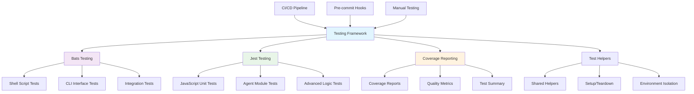
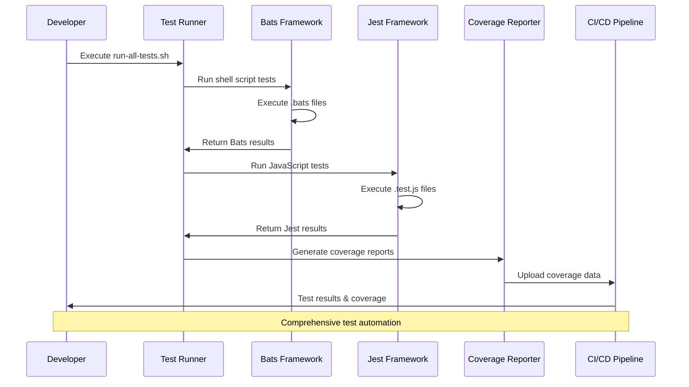

## 🧪 LightSpeedWP Testing Framework

This folder contains all automated tests for the LightSpeed WP automation project. All tests are now organised by script type and feature area, with a single `utility` subfolder for all script tests, and a dedicated folder for Jest (JavaScript) tests.

## 📊 Testing Architecture

## Structure

### 📁 Test Directory Organization

Each subfolder includes comprehensive documentation and specialized test coverage:

- **[`awesome-copilot/`](./awesome-copilot/README.md)** — Jest tests for awesome-copilot automation scripts
  - Tests for `update-readme.js`, `validate-collections.js`, and `yaml-parser.js`
  - Validates script loading and basic functionality

- **[`includes/`](./includes/README.md)** — Shared test helpers and utilities with specialized subfolders:
  - **[`cli/`](./includes/cli/README.md)** — CLI utility testing helpers and shared functions
  - **[`core/`](./includes/core/README.md)** — Core testing functionality including colors, logging, and validation
  - **[`deployment/`](./includes/deployment/README.md)** — Deployment testing helpers and environment setup
  - **[`filesystem/`](./includes/filesystem/README.md)** — File system operation helpers and utilities

- **[`maintenance/`](./maintenance/README.md)** — Comprehensive tests for maintenance and automation scripts
  - Tests for README generation, label management, badge updates, and changelog automation
  - Covers dry-run modes, CI/CD integration, and edge case handling

- **[`projects/`](./projects/README.md)** — Project management and GitHub integration tests
  - **[`fixtures/`](./projects/fixtures/README.md)** — Test fixtures and sample data for project tests
  - Tests for client delivery projects, product development workflows, and project automation

- **[`pytests/`](./pytests/README.md)** — Python-based tests for documentation validation
  - Tests for changelog validation, documentation links, markdown structure, and PR templates
  - Includes utility functions for changed file detection

- **[`utility/`](./utility/README.md)** — Comprehensive Bats and Jest tests for all utility scripts
  - `.bats` files: Shell/CLI tests for Node.js and shell scripts
  - `.test.js` files: Jest unit tests for Node.js modules and agent logic

### 📄 Core Test Files

- **`test-helper.bash`** — Shared Bats test helpers for setup/teardown and environment isolation
- **`tests-run-all-tests.bats`** — Bats test for the test runner script  
- **[`TEST_COVERAGE_SUMMARY.md`](./TEST_COVERAGE_SUMMARY.md)** — Detailed documentation of test coverage, structure, and best practices

## Usage

- Run all Bats tests: `bats tests/`
- Run all tests with the runner: `./run-all-tests.sh`
- Run Jest tests: `npm test` or `npx jest`

## Best Practices

- Every script in `/scripts/utility/` should have a corresponding test here.
- Use `test-helper.bash` for consistent setup and teardown.
- Expand tests to cover both success and failure scenarios.
- Keep test names and descriptions clear and maintainable.

## 🔄 Test Execution Workflow

## 🎯 Test Coverage Flow

See `TEST_COVERAGE_SUMMARY.md` for full coverage details and examples.

---

## 📚 References

### 🔗 Documentation Links

#### Core Testing Documentation
- [Test Coverage Summary](./TEST_COVERAGE_SUMMARY.md) — Comprehensive coverage analysis and test details
- [Jest Configuration](../jest.config.js) — JavaScript testing framework configuration
- [Test Runner Script](../run-all-tests.sh) — Automated test execution script
- [LightSpeedWP Testing Guidelines](../.github/instructions/tests.instructions.md) — Testing standards and best practices

#### Test Folder Documentation
- [Awesome Copilot Tests](./awesome-copilot/README.md) — Jest tests for awesome-copilot automation scripts
- [Test Includes & Helpers](./includes/README.md) — Shared test utilities and helper functions
- [CLI Testing Helpers](./includes/cli/README.md) — Command-line interface testing utilities  
- [Core Testing Functions](./includes/core/README.md) — Core testing functionality and validation
- [Deployment Test Helpers](./includes/deployment/README.md) — Deployment testing and environment setup
- [Filesystem Test Utilities](./includes/filesystem/README.md) — File system operation testing helpers
- [Maintenance Script Tests](./maintenance/README.md) — Tests for maintenance and automation scripts
- [Project Management Tests](./projects/README.md) — GitHub project integration and workflow tests
- [Test Fixtures & Data](./projects/fixtures/README.md) — Sample data and test fixtures
- [Python Documentation Tests](./pytests/README.md) — Python-based documentation validation tests
- [Utility Script Tests](./utility/README.md) — Comprehensive utility script testing suite

### 🛠️ Development Resources

#### Testing Frameworks & Tools
- [Bats Testing Framework](https://github.com/bats-core/bats-core) — Bash Automated Testing System
- [Jest Testing Documentation](https://jestjs.io/docs/getting-started) — JavaScript testing framework
- [Shared Test Helpers](./test-helper.bash) — Common Bats testing utilities
- [GitHub Actions Tests Workflow](../.github/workflows/tests.yml) — CI/CD testing automation

#### Related Project Documentation  
- [Scripts Directory](../scripts/README.md) — Main automation scripts documentation
- [Schema Validation](../schemas/README.md) — JSON schema validation and configuration
- [CodeRabbit Schemas](../schemas/coderabbit/README.md) — AI code review configuration schemas
- [WordPress Automation Schemas](../schemas/header-footer-agent/README.md) — WordPress theme automation schemas
- [Coverage Reports](../coverage/README.md) — Test coverage reporting and analysis
- [HTML Coverage Reports](../coverage/lcov-report/README.md) — Interactive coverage visualization

### 🎯 AI & Automation

- [Custom Instructions](../.github/custom-instructions.md)
- [Agents Documentation](../.github/agents/agent.md)
- [Scripts Directory](../scripts/)
- [Contributing Guidelines](../CONTRIBUTING.md)

---

_🧪 Ensuring quality through comprehensive testing and continuous coverage validation._

<!-- RANDOM FOOTER: 🧪 Docs signed by Copilot for LightSpeedWP -->
