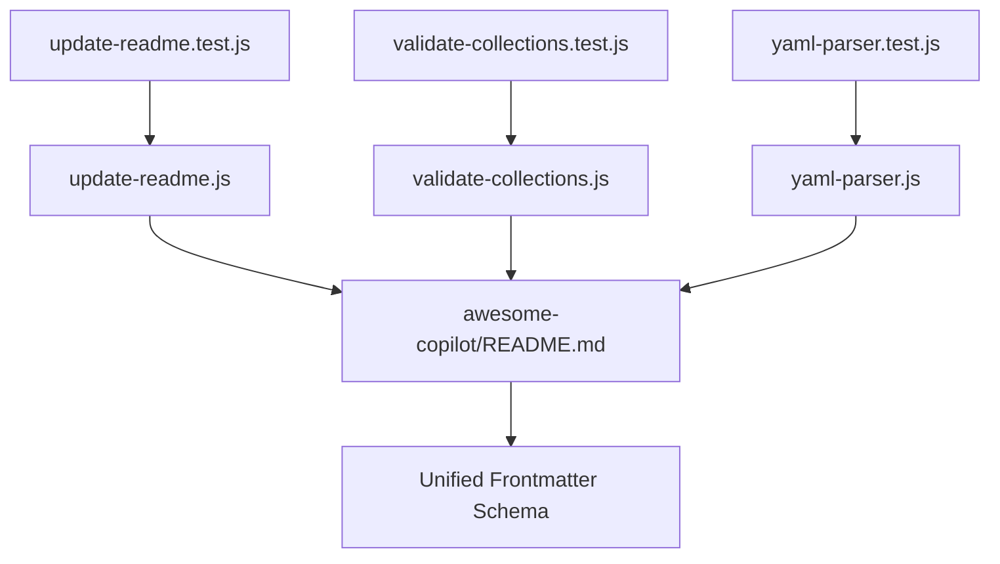

# Awesome Copilot Tests 🧪  

## Overview

This directory contains comprehensive Jest tests for the awesome-copilot scripts, ensuring robust automation and schema compliance for LightSpeed WP.

## Structure



- `update-readme.test.js`: Tests for the update-readme script functionality
- `validate-collections.test.js`: Tests for collection validation logic
- `yaml-parser.test.js`: Tests for YAML parsing utilities

## Usage / Quickstart

```bash
# Run all Jest tests
npm test

# Run only awesome-copilot tests
npx jest awesome-copilot/
```

## Contribution & Development

- Follow the coding style in [CODING-STYLE.md](../../../docs/CODING-STYLE.md)
- Add new tests for any new scripts in `/scripts/awesome-copilot/`
- Ensure all tests pass and coverage remains high

## Parameters & Inputs

- No external parameters required; tests run on local scripts
- Ensure Node.js, npm, and Jest are installed

## Examples

- See each test file for usage examples and expected outputs

## Validation / Testing

- Tests validate script loading, basic functionality, exports, and project compatibility
- Coverage badge reflects current test coverage

## Environment / Dependencies

- Node.js and npm
- Jest testing framework
- Scripts in `/scripts/awesome-copilot/`

## Limitations / Notes

- Only covers scripts in awesome-copilot; add tests for new scripts as needed

---

## References

- [Main Tests README](../README.md)
- [Root README](../../README.md)
- [Frontmatter Schema](../../../schemas/frontmatter.schema.json)
- [YAML Documentation](../../../docs/YAML.md)
- [Frontmatter Schema Documentation](../../../docs/FRONTMATTER-SCHEMA.md)
- [Coding Style](../../../docs/CODING-STYLE.md)
