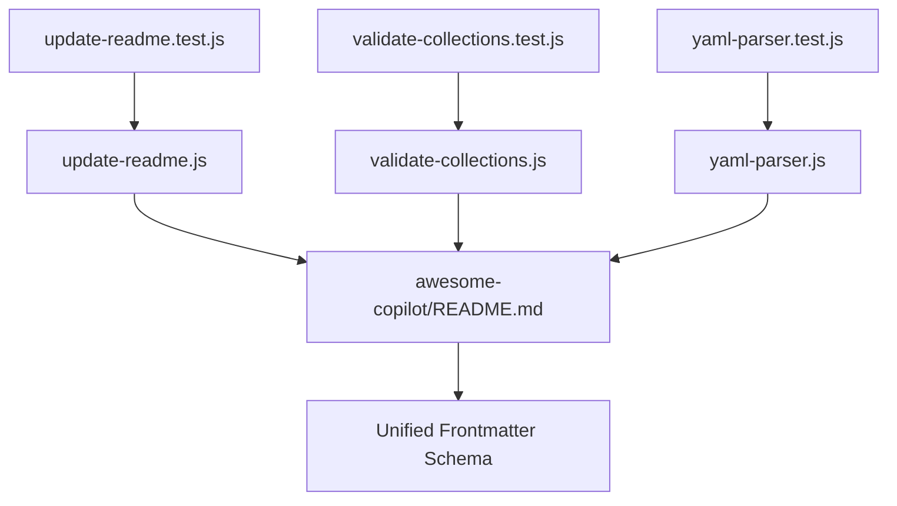

# Awesome Copilot Tests

This directory contains Jest tests for the awesome-copilot scripts.

## Test Files

- `update-readme.test.js`: Tests for the update-readme script functionality
- `validate-collections.test.js`: Tests for collection validation logic
- `yaml-parser.test.js`: Tests for YAML parsing utilities

## Running Tests

To run these tests:

```bash
# Run all Jest tests
npm test

# Run only awesome-copilot tests
npx jest awesome-copilot/
```

## Test Structure

Each test file follows the minimal Jest pattern:

- Tests that the corresponding script can be loaded without errors
- Validates basic functionality and exports
- Ensures compatibility with the project structure

## Dependencies

These tests require:

- Node.js and npm
- Jest testing framework
- The corresponding scripts in `/scripts/awesome-copilot/`

## Test Flow & Dependencies



## References

- [Unified Frontmatter Schema](../../schemas/frontmatter.schema.json)
- [Awesome Copilot Scripts](../../scripts/awesome-copilot/README.md)
- [Chatmode Frontmatter Documentation](../../docs/CHATMODE-FRONTMATTER.md)
