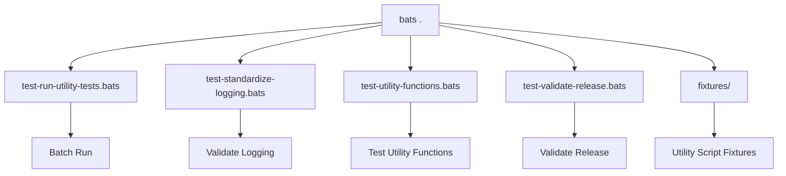

# Utility Test Suite

This folder contains Bats tests for utility scripts and functions in `scripts/utility/`. These tests cover logging, validation, release checks, and core utility logic.



## Test Files

- `test-run-utility-tests.bats` — Batch runner for utility tests
- `test-standardize-logging.bats` — Validates logging functions
- `test-utility-functions.bats` — Tests core utility functions
- `test-validate-release.bats` — Validates release logic
- `fixtures/` — Test fixtures for utility scripts

## Coverage

- Logging and output formatting
- Utility function correctness
- Release validation
- Edge cases and error handling
- Dry-run and CI/CD integration

## Running Tests

```bash
bats .
```

## Contributing

See [CONTRIBUTING.md](../../CONTRIBUTING.md) for details.

---

## References

- [Main Tests README](../README.md)
- [Root README](../../README.md)
- [Frontmatter Schema](../../../schemas/frontmatter.schema.json)
- [YAML Documentation](../../../docs/YAML.md)
- [Frontmatter Schema Documentation](../../../docs/FRONTMATTER-SCHEMA.md)
