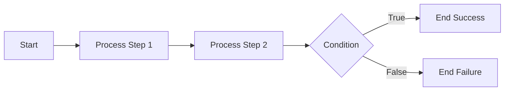

# Flowchart Diagram Example

```mermaid
flowchart LR
    A[Start] --> B[Process Step 1]
    B --> C[Process Step 2]
    C --> D{Condition}
    D -->|True| E[End Success]
    D -->|False| F[End Failure]
```
