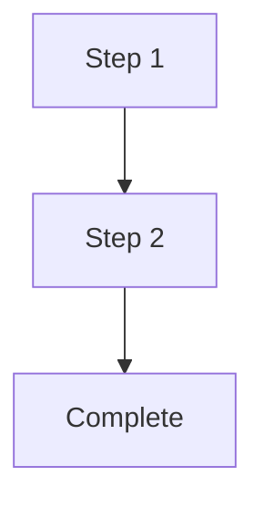

# Multiple Diagrams

First diagram:

```mermaid
graph TD
  accTitle: graph diagram
  accDescr: graph flowchart
    A[Step 1] --> B[Step 2]
    B --> C[Complete]
```

Some text in between.

Second diagram:

```mermaid
flowchart LR
  accTitle: flowchart diagram
  accDescr: flowchart flowchart
    X[Input] --> Y[Process] --> Z[Output]
```
