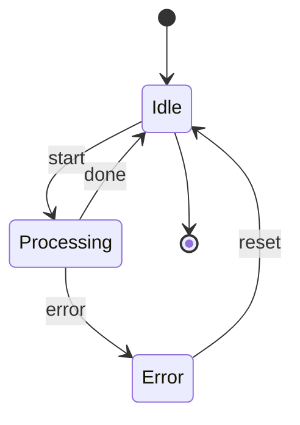

# State Diagram Example

```mermaid
stateDiagram-v2
    [*] --> Idle
    Idle --> Processing: start
    Processing --> Idle: done
    Processing --> Error: error
    Error --> Idle: reset
    Idle --> [*]
```
