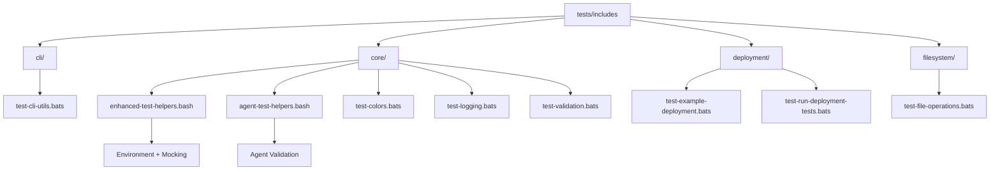
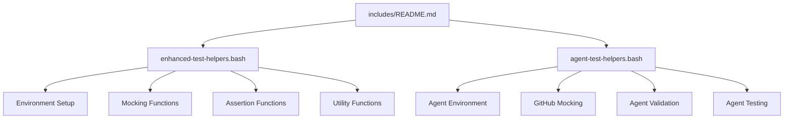

description: "Reusable test helper functions and utilities for LightSpeed WP Bats test suites including enhanced helpers, agent helpers, and integration with the main test-helper.bash."
references:

- ../README.md
- ../../README.md
- ../../../schemas/frontmatter.schema.json
- ../../../docs/YAML.md
- ../../../docs/FRONTMATTER-SCHEMA.md
  last_updated: 2025-10-25
  version: 2.0
  owners:
- lightspeedwp

# Includes Test Helpers 🧩  

## Overview

Reusable test helper functions and utilities for LightSpeed WP Bats test suites. Provides advanced environment setup, mocking, assertions, agent-focused helpers, and integration with the main `test-helper.bash`.

## Structure



### Subfolder Summary

- `cli/` – CLI utility test coverage (`test-cli-utils.bats`).
- `core/` – Fundamental helpers & validation (colors, logging, validation tests).
- `deployment/` – Deployment flow and orchestration tests.
- `filesystem/` – File operation and path integrity tests.
- `integration/` – Integration tests validating interactions between include modules.

### Include Module Unit Tests

Comprehensive test coverage for modular shell script includes:

- **test-colors.bats** – Color codes, ANSI formatting, terminal support detection
- **test-logging.bats** – Logging levels, file output, log rotation, color integration
- **test-validation.bats** – Input validation (files, directories, versions, emails, URLs, ports, IP addresses, JSON, YAML, path safety)
- **test-cli-utils.bats** – CLI argument parsing, help display, confirmation prompts, progress indicators, dry-run mode
- **test-file-operations.bats** – Safe file operations, atomic writes, backup creation, timestamp handling
- **test-git-functions.bats** – Git repository detection, branch/commit operations, working tree validation

### Integration Tests

- **integration/test-logging-integration.bats** – Cross-module integration testing (logging + validation + colors), error propagation, concurrent operations

### Key Helper Scripts

- `enhanced-test-helpers.bash` – Advanced environment, mocking, assertions, utilities.
- `agent-test-helpers.bash` – Agent structure, GitHub API/event mocking, dry-run safety.
- `../test-helper.bash` – Baseline test utilities auto-loaded by suites.



## Usage / Quickstart

Load needed helpers explicitly for clarity and performance:

```bash
#!/usr/bin/env bats
# Load advanced helpers
load "$(dirname "$BATS_TEST_FILENAME")/../includes/enhanced-test-helpers.bash"
load "$(dirname "$BATS_TEST_FILENAME")/../includes/agent-test-helpers.bash"
```

To run only includes-related tests:

```bash
npx bats tests/includes
```

## Environment / Dependencies

- Bats (test runner)
- Bash (target shell for helpers)
- ShellCheck (linting optional but recommended)
- Git (for git mocking helpers)

## Validation / Testing

- Helper functions validated indirectly through consuming test suites.
- Shell standard compliance via `assert_script_follows_standards`.
- Git and external command isolation through mocking functions.
- Agent structure integrity via `assert_agent_follows_standards`.

### Test Coverage

Comprehensive unit and integration tests for all include modules:

- **90%+ line coverage** for all include functions
- **100% error condition coverage** for critical paths
- **Edge case testing** for special characters, Unicode, large files, empty inputs
- **Performance testing** for large data sets and concurrent operations
- **Security testing** for directory traversal prevention and input sanitization
- **Integration testing** for cross-module interactions and dependency chains

### Running Include Tests

Run all include module tests:

```bash
bats tests/includes/test-*.bats
```

Run integration tests:

```bash
bats tests/includes/integration/
```

Run specific module tests:

```bash
bats tests/includes/test-logging.bats
bats tests/includes/test-validation.bats
```

## Usage

Load the appropriate test helper files in your Bats tests:

```bash
#!/usr/bin/env bats
# Load test helpers
load "$(dirname "$BATS_TEST_FILENAME")/../includes/enhanced-test-helpers.bash"
load "$(dirname "$BATS_TEST_FILENAME")/../includes/agent-test-helpers.bash"
```

## Available Helpers

### enhanced-test-helpers.bash

Extends the basic `test-helper.bash` with advanced capabilities:

- **Environment Setup:**
  - `setup_enhanced_test_environment()` - Enhanced test environment
  - `cleanup_enhanced_test_environment()` - Enhanced cleanup
  - `source_includes()` - Load all include files

- **Mocking Functions:**
  - `mock_git_command()` - Mock specific git commands
  - `create_test_git_repo()` - Create test git repository
  - `create_test_script()` - Create test script with includes

- **Assertion Functions:**
  - `assert_log_contains()` - Assert log contains message
  - `assert_function_exists()` - Assert function is defined
  - `assert_script_follows_standards()` - Validate script standards
  - `assert_no_shellcheck_errors()` - Validate with ShellCheck

- **Utility Functions:**
  - `run_with_timeout()` - Run command with timeout
  - `create_fixture_file()` - Create test fixture
  - `load_fixture()` - Load fixture content

### agent-test-helpers.bash

Specialized helpers for testing LightSpeed WP agents:

- **Agent Environment:**
  - `setup_agent_test_environment()` - Setup for agent testing
  - `cleanup_agent_test_environment()` - Agent-specific cleanup

- **GitHub Mocking:**
  - `create_mock_github_event()` - Mock GitHub webhook events
  - `mock_github_api()` - Mock GitHub API responses
  - `create_mock_github_response()` - Create API response files

- **Agent Validation:**
  - `validate_agent_structure()` - Validate agent file structure
  - `validate_js_agent_structure()` - Validate JavaScript agents
  - `assert_agent_follows_standards()` - Comprehensive agent validation

- **Agent Testing:**
  - `run_agent_test()` - Run agent with test parameters
  - `test_agent_dry_run()` - Test agent in dry-run mode

## Test Structure Standards

### Basic Test File Template

```bash
#!/usr/bin/env bats
# ============================================================================
# Test Name: test-example-script.bats
# Testing: example-script.sh
# Description: Test suite for example script functionality
# Version: v1.0.0
# Date: 2025-10-17
# Author: LightSpeed WP Team
# ============================================================================

# Load test helpers
load "$(dirname "$BATS_TEST_FILENAME")/../includes/enhanced-test-helpers.bash"

setup() {
    setup_enhanced_test_environment
    source_includes
}

teardown() {
    cleanup_enhanced_test_environment
}

# ----- Section: Basic Functionality Tests -----

# ============================================================================
# Test Name: "script executes without errors"
# Test Type: Smoke Test
# Test Scope: Validates that the script runs successfully with default parameters
# ============================================================================
@test "script executes without errors" {
    run "${BATS_TEST_DIRNAME}/../scripts/example-script.sh" --help
    [ "$status" -eq 0 ]
}
```

### Agent Test Template

```bash
#!/usr/bin/env bats
# ============================================================================
# Test Name: test-example-agent.bats
# Testing: example.agent.js
# Description: Test suite for example agent functionality
# Version: v1.0.0
# Date: 2025-10-17
# Author: LightSpeed WP Team
# ============================================================================

# Load test helpers
load "$(dirname "$BATS_TEST_FILENAME")/../includes/agent-test-helpers.bash"

setup() {
    setup_agent_test_environment
}

teardown() {
    cleanup_agent_test_environment
}

# ----- Section: Agent Structure Tests -----

# ============================================================================
# Test Name: "agent follows LightSpeed WP standards"
# Test Type: Structure Validation
# Test Scope: Validates agent file structure and documentation
# ============================================================================
@test "agent follows LightSpeed WP standards" {
    assert_agent_follows_standards "example.agent.js"
}

# ============================================================================
# Test Name: "agent supports dry-run mode"
# Test Type: Safety Validation
# Test Scope: Ensures agent can run in dry-run mode without making changes
# ============================================================================
@test "agent supports dry-run mode" {
    run test_agent_dry_run "example.agent.js"
    [ "$status" -eq 0 ]
    assert_log_contains "DRY RUN"
}
```

## Integration with Main Test Helper

These enhanced helpers are designed to work alongside the main `test-helper.bash` file:

- Automatically loads basic helpers if available
- Extends functionality without replacing
- Maintains compatibility with existing tests
- Provides additional capabilities for complex testing scenarios

## Mocking and Fixtures

### Git Command Mocking

```bash
@test "handles git status command" {
    mock_git_command "status" "echo 'On branch main'"

    run git status
    [ "$status" -eq 0 ]
    [[ "$output" =~ "On branch main" ]]
}
```

### Test Fixtures

```bash
@test "processes configuration file" {
    local config_file
    config_file=$(create_fixture_file "test-config.json" '{"key": "value"}')

    run process_config "$config_file"
    [ "$status" -eq 0 ]
}
```

## Best Practices

1. **Use appropriate helpers**: Load only the helpers you need
2. **Proper setup/teardown**: Always clean up test environment
3. **Descriptive test names**: Use clear, descriptive test function names
4. **Document test scope**: Include test documentation blocks
5. **Isolate tests**: Each test should be independent
6. **Mock external dependencies**: Use mocking for git, APIs, etc.
7. **Validate standards**: Use assertion helpers for compliance checking

## Contribution & Development

When adding new test helpers:

1. Follow the established naming convention
2. Include complete header documentation
3. Document all functions with proper format
4. Provide usage examples in this README
5. Ensure compatibility with existing helpers
6. Add tests for the helper functions themselves

## CI/CD Integration

CI pipelines leverage these helpers for consistent environment setup, reusable mocking layers, and standards validation across all shell-based automation.

## Limitations / Notes

- Helpers assume POSIX-compatible bash environment.
- Not all functions are unit-tested in isolation—coverage relies on integration tests.
- Mocking layer intentionally lightweight; extend cautiously to avoid masking failures.

These test helpers integrate with the CI/CD pipeline:

- Support timeout handling for CI environments
- Provide fixtures for consistent testing
- Enable comprehensive validation in automated workflows
- Support both local and CI test execution

---

## References

- [Main Tests README](../README.md)
- [Root README](../../README.md)
- [Frontmatter Schema](../../../schemas/frontmatter.schema.json)
- [YAML Documentation](../../../docs/YAML.md)
- [Frontmatter Schema Documentation](../../../docs/FRONTMATTER-SCHEMA.md)
