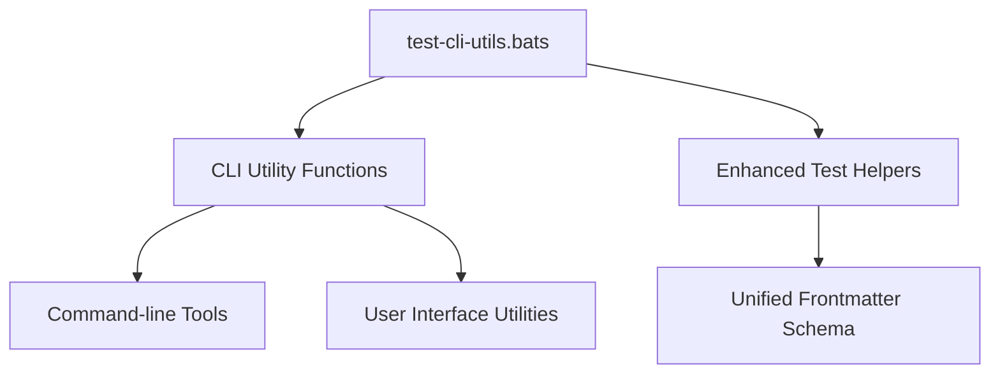

# CLI Tests

This directory contains tests for command-line interface utilities and helper functions.



## Test Files

- `test-cli-utils.bats`: Bats tests for CLI utility functions and command-line tools

## Purpose

These tests validate:

- CLI argument parsing and validation
- Command-line tool functionality
- User interface utilities
- Interactive command behaviors
- Help text and usage information

## Running Tests

```bash
# Run CLI tests specifically
bats tests/includes/cli/

# Run all includes tests
bats tests/includes/
```

## Dependencies

- Bats testing framework
- CLI utilities and tools being tested
- Test helpers from parent includes directory

---

## References

- [Main Includes README](../README.md)
- [Root README](../../README.md)
- [Frontmatter Schema](../../../schemas/frontmatter.schema.json)
- [YAML Documentation](../../../docs/YAML.md)
- [Frontmatter Schema Documentation](../../../docs/FRONTMATTER-SCHEMA.md)
