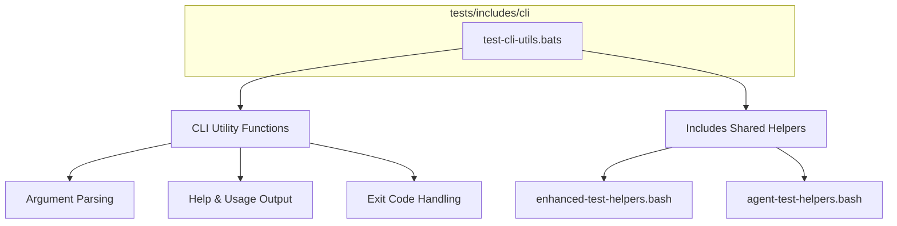

# CLI Tests 🧪

Badges: (placeholder – will be auto-inserted by global badge workflow)
> Jest ⬡ Bats ✅ ShellCheck 🔍 Coverage % 📊 Frontmatter ✓

## Overview

This folder houses automated tests for CLI utility functions and user-facing command behaviors. It ensures:

- Consistent argument parsing + validation
- Accurate help / usage output formatting
- Reliable exit codes and error handling
- Integration with shared includes helpers
- Future extensibility for multi-command orchestration

## Structure



## Test Files

| File | Purpose |
| ---- | ------- |
| `test-cli-utils.bats` | Core Bats tests for CLI parsing, usage rendering, and helper integration |

## Usage

```bash
# Run only CLI tests
bats tests/includes/cli/

# Run all includes tests
bats tests/includes/

# (Optional) With debug / verbose
CLI_TEST_DEBUG=1 bats tests/includes/cli/
```

## Environment

| Variable | Effect |
| -------- | ------ |
| `CLI_TEST_DEBUG` | Enables verbose diagnostic logging in helpers |
| `NO_COLOR` | Forces plain output for snapshot comparisons |

## Validation & Quality

| Check | Tool | Notes |
| ----- | ---- | ----- |
| Shell lint | ShellCheck | Applied to any sourced helper scripts |
| Frontmatter | Validation script | Ensures metadata matches `frontmatter.schema.json` |
| Markdown | MD Lint | Spacing, headings, fenced code block rules |

## Dependencies

- Bats (test runner)
- Shared helper scripts in `tests/includes/`
- CLI utility source functions (located in corresponding scripts/includes paths)

## CI/CD Integration

Pipeline runs these tests in the includes phase. Failures here gate downstream integration tests. Coverage for shell functions is aggregated into the global coverage report.

## Limitations & Future Work

- Additional snapshot tests for complex multi-flag combinations
- Expand interactive tests (mock TTY input)
- Integrate timing benchmarks for large argument sets

## References

- [Parent Includes README](../README.md)
- [Tests Root README](../../README.md)
- [Repository Root README](../../../README.md)
- [Frontmatter Schema](../../../schemas/frontmatter.schema.json)
- [YAML Docs](../../../docs/YAML.md)
- [Frontmatter Schema Docs](../../../docs/FRONTMATTER-SCHEMA.md)
