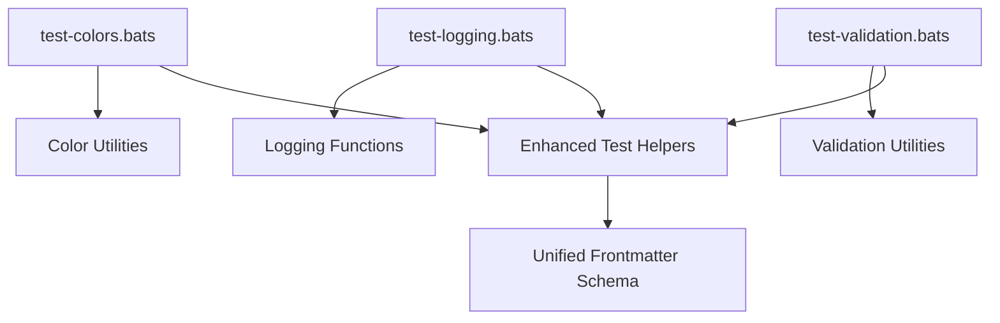

# Core Tests

This directory contains tests for core functionality and shared utilities.



## Test Files

- `test-colors.bats`: Tests for color utilities and terminal formatting
- `test-logging.bats`: Tests for logging functions and output formatting
- `test-validation.bats`: Tests for input validation and data verification utilities

## Purpose

These tests validate:

- Core utility functions used across the project
- Logging and output formatting consistency
- Color and terminal display functionality
- Input validation and sanitization
- Error handling and reporting mechanisms

## Running Tests

```bash
# Run core tests specifically
bats tests/includes/core/

# Run all includes tests
bats tests/includes/
```

## Dependencies

- Bats testing framework
- Core utility scripts and functions
- Test helpers from parent includes directory
- Terminal color support for color testing

---

## References

- [Main Includes README](../README.md)
- [Root README](../../README.md)
- [Frontmatter Schema](../../../schemas/frontmatter.schema.json)
- [YAML Documentation](../../../docs/YAML.md)
- [Frontmatter Schema Documentation](../../../docs/FRONTMATTER-SCHEMA.md)
