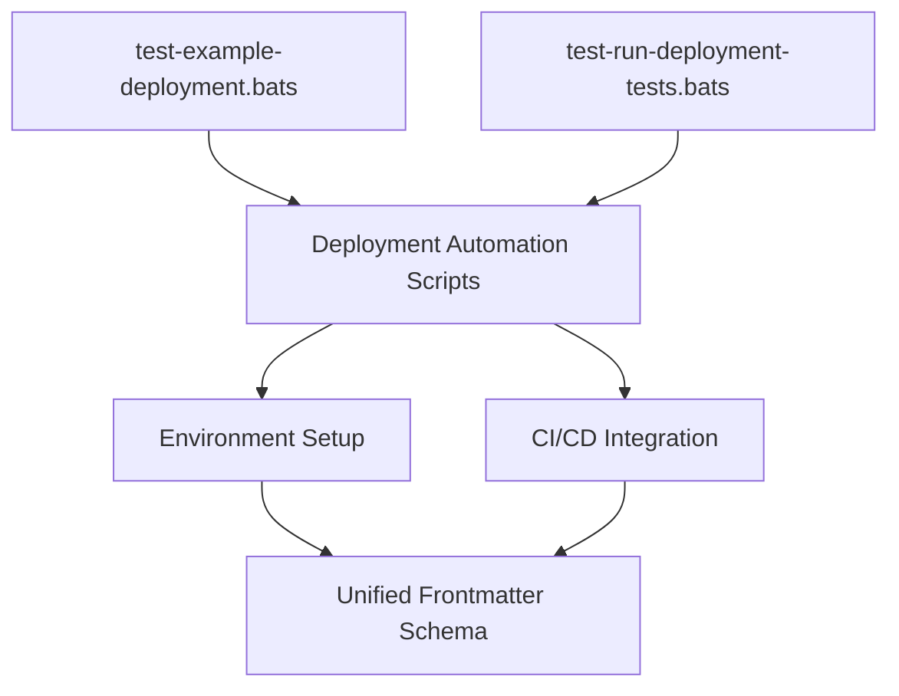

# Deployment Test Suite

This folder contains Bats tests for deployment automation scripts in `scripts/deployment/`. These tests validate deployment logic, environment setup, and integration with CI/CD workflows.

## Test Files

- `test-example-deployment.bats` — Example deployment test
- `test-run-deployment-tests.bats` — Batch runner for deployment tests

## Coverage

- Deployment logic and automation
- Environment setup and validation
- CI/CD integration
- Edge cases and error handling
- Dry-run and preview modes

## Running Tests

```bash
bats .
```

## Test Flow & Dependencies



## Contributing

See [CONTRIBUTING.md](../../CONTRIBUTING.md) for details.

## References

- [Unified Frontmatter Schema](../../../schemas/frontmatter.schema.json)
- [Contribution Guidelines](../../CONTRIBUTING.md)
