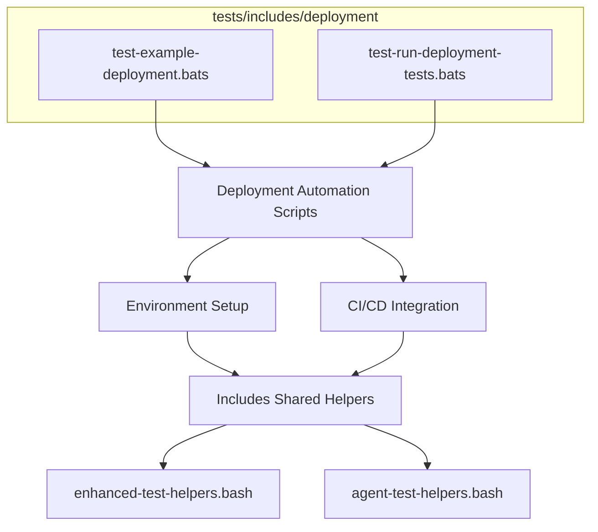

---

# Deployment Test Suite 🚀

Badges: (placeholder – will be auto-inserted by global badge workflow)

> Jest ⬡ Bats ✅ ShellCheck 🔍 Coverage % 📊 Frontmatter ✓

## Overview

Automated tests for deployment automation scripts. These ensure:

- Reliable deployment logic and automation
- Environment setup and validation
- CI/CD workflow integration
- Robust error handling and dry-run support

## Structure



## Test Files

| File                             | Purpose                           |
| -------------------------------- | --------------------------------- |
| `test-example-deployment.bats`   | Example deployment test           |
| `test-run-deployment-tests.bats` | Batch runner for deployment tests |

## Usage

```bash
# Run only deployment tests
bats tests/includes/deployment/

# Run all includes tests
bats tests/includes/

# (Optional) With debug / verbose
DEPLOY_TEST_DEBUG=1 bats tests/includes/deployment/
```

## Environment

| Variable            | Effect                                        |
| ------------------- | --------------------------------------------- |
| `DEPLOY_TEST_DEBUG` | Enables verbose diagnostic logging in helpers |
| `NO_COLOR`          | Forces plain output for snapshot comparisons  |

## Validation & Quality

| Check       | Tool              | Notes                                              |
| ----------- | ----------------- | -------------------------------------------------- |
| Shell lint  | ShellCheck        | Applied to any sourced helper scripts              |
| Frontmatter | Validation script | Ensures metadata matches `frontmatter.schema.json` |
| Markdown    | MD Lint           | Spacing, headings, fenced code block rules         |

## Dependencies

- Bats (test runner)
- Shared helper scripts in `tests/includes/`
- Deployment automation scripts (located in corresponding scripts/deployment paths)

## CI/CD Integration

Pipeline runs these tests in the includes phase. Failures here gate downstream integration tests. Coverage for shell functions is aggregated into the global coverage report.

## Limitations & Future Work

- Expand dry-run and preview mode coverage
- Add edge-case environment setup tests
- Integrate deployment rollback scenario tests

---

## References

- [Main Includes README](../README.md)
- [Root README](../../README.md)
- [Frontmatter Schema](../../../schemas/frontmatter.schema.json)
- [YAML Documentation](../../../docs/YAML.md)
- [Frontmatter Schema Documentation](../../../docs/FRONTMATTER-SCHEMA.md)
