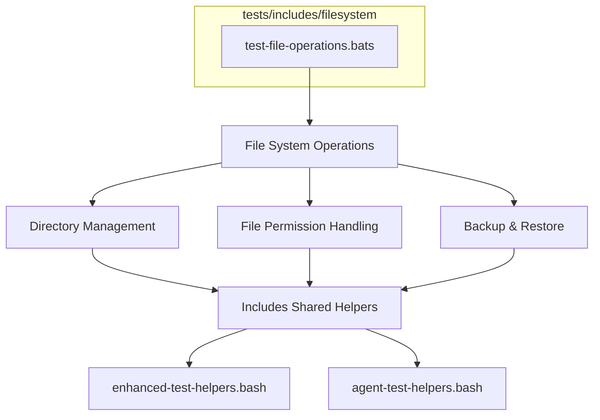
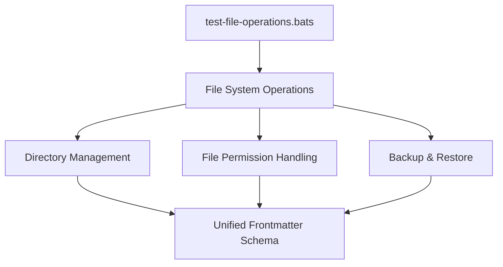

---


# Filesystem Tests 🗄️

Badges: (placeholder – will be auto-inserted by global badge workflow)
> Jest ⬡ Bats ✅ ShellCheck 🔍 Coverage % 📊 Frontmatter ✓

## Overview

Automated tests for filesystem operations and file management utilities. These ensure:

- Reliable file creation, modification, and deletion
- Directory structure management
- File permission handling
- Path resolution and validation
- Backup and restore operations
- Robust error handling and safety checks

## Structure



## Test Files

| File | Purpose |
| ---- | ------- |
| `test-file-operations.bats` | Bats tests for file system operations, file manipulation, and directory management |

## Usage

```bash
# Run only filesystem tests
bats tests/includes/filesystem/

# Run all includes tests
bats tests/includes/

# (Optional) With debug / verbose
FS_TEST_DEBUG=1 bats tests/includes/filesystem/
```

## Environment

| Variable | Effect |
| -------- | ------ |
| `FS_TEST_DEBUG` | Enables verbose diagnostic logging in helpers |
| `NO_COLOR` | Forces plain output for snapshot comparisons |

## Validation & Quality

| Check | Tool | Notes |
| ----- | ---- | ----- |
| Shell lint | ShellCheck | Applied to any sourced helper scripts |
| Frontmatter | Validation script | Ensures metadata matches `frontmatter.schema.json` |
| Markdown | MD Lint | Spacing, headings, fenced code block rules |

## Dependencies

- Bats (test runner)
- Standard filesystem utilities (cp, mv, rm, mkdir, etc.)
- Shared helper scripts in `tests/includes/`
- Temporary directory support for isolated testing

## CI/CD Integration

Pipeline runs these tests in the includes phase. Failures here gate downstream integration tests. Coverage for shell functions is aggregated into the global coverage report.

## Limitations & Future Work

- Expand permission and error scenario coverage
- Add snapshot tests for backup/restore
- Integrate edge-case path resolution tests

## References

- [Parent Includes README](../README.md)
- [Tests Root README](../../README.md)
- [Repository Root README](../../../README.md)
- [Frontmatter Schema](../../../schemas/frontmatter.schema.json)
- [YAML Docs](../../../docs/YAML.md)
- [Frontmatter Schema Docs](../../../docs/FRONTMATTER-SCHEMA.md)



- [Frontmatter Schema Documentation](../../../docs/FRONTMATTER-SCHEMA.md)
