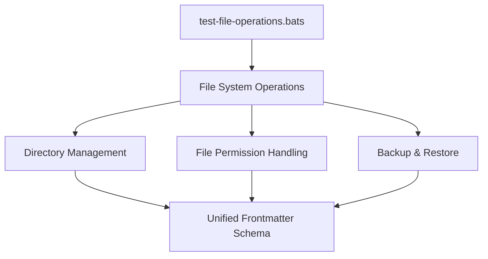

# Filesystem Tests

This directory contains tests for filesystem operations and file management utilities.

## Test Files

- `test-file-operations.bats`: Bats tests for file system operations, file manipulation, and directory management

## Purpose

These tests validate:

- File creation, modification, and deletion operations
- Directory structure management
- File permission handling
- Path resolution and validation
- File system safety checks and error handling
- Backup and restore operations

## Running Tests

```bash
# Run filesystem tests specifically
bats tests/includes/filesystem/

# Run all includes tests
bats tests/includes/
```

## Test Flow & Dependencies



## Dependencies

- Bats testing framework
- Standard filesystem utilities (cp, mv, rm, mkdir, etc.)
- Test helpers from parent includes directory
- Temporary directory support for isolated testing

## References

- [Unified Frontmatter Schema](../../../schemas/frontmatter.schema.json)
