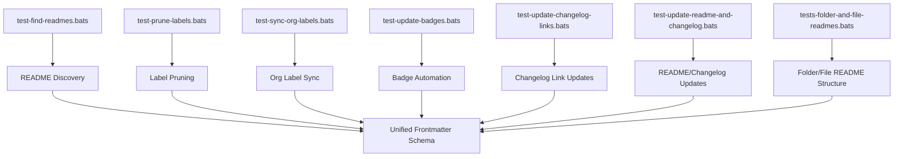

# Maintenance Test Suite

This folder contains Bats tests for all maintenance automation scripts in `scripts/maintenance/`. These tests validate label management, README and changelog updates, badge automation, and other maintenance operations.

## Test Files

- `test-find-readmes.bats` — Validates README discovery logic
- `test-prune-labels.bats` — Tests label pruning and protection
- `test-sync-org-labels.bats` — Validates org-wide label sync
- `test-update-badges.bats` — Tests badge update automation
- `test-update-changelog-links.bats` — Validates changelog link updates
- `test-update-readme-and-changelog.bats` — Tests README and changelog update logic
- `tests-folder-and-file-readmes.bats` — Validates folder/file README structure
- `test-run-maintenance-tests.bats` — Batch runner for maintenance tests

## Coverage

- Label management and protection
- README/changelog automation
- Badge updates
- Edge cases and error handling
- Dry-run and CI/CD integration

## Running Tests

```bash
bats .
```

## Maintenance Workflow



## Contributing

See [CONTRIBUTING.md](../../CONTRIBUTING.md) for details.

## References

- [Unified Frontmatter Schema](../../schemas/frontmatter.schema.json)
- [Contribution Guidelines](../../CONTRIBUTING.md)
