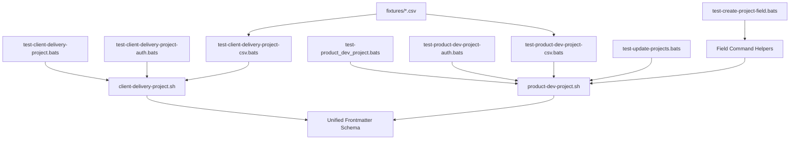

# Project Script Test Suite

[](https://www.gnu.org/licenses/gpl-3.0.html)

This folder contains comprehensive [Bats](https://github.com/bats-core/bats-core) test suites for all GitHub Project automation scripts in `scripts/project/`. These tests ensure robust, spec-compliant automation for both client delivery and product development workflows.

## Test Architecture



## Test Files Overview

| Test File                                | Purpose                                                                                                                                        | Status     |
| ---------------------------------------- | ---------------------------------------------------------------------------------------------------------------------------------------------- | ---------- |
| `test-client-delivery-project.bats`      | Tests `client-delivery-project.sh` for argument handling, help output, dry-run, field creation, idempotency, env overrides, and error handling | 6/9 pass   |
| `test-client-delivery-project-auth.bats` | Tests authentication logic for `client-delivery-project.sh` (gh CLI presence, auth, scopes)                                                    | 4/4 pass   |
| `test-client-delivery-project-csv.bats`  | Tests CSV-driven settings import and access management for `client-delivery-project.sh`                                                        | 2/2 pass   |
| `test-product_dev_project.bats`          | Tests `product-dev-project.sh` for CLI commands, dry-run, field creation, idempotency, env overrides, and error handling                       | 12/12 pass |
| `test-product-dev-project-auth.bats`     | Tests authentication logic for `product-dev-project.sh` (gh CLI presence, auth, scopes)                                                        | 4/4 pass   |
| `test-product-dev-project-csv.bats`      | Tests CSV-driven settings import and access management for `product-dev-project.sh`                                                            | 0/2 pass   |
| `test-create-project-field.bats`         | Tests helper logic for field command construction and dry-run output in project scripts                                                        | 2/2 pass   |
| `test-update-projects.bats`              | Tests `update-projects.sh` for field management, CSV-driven creation, options, dry-run, deletion, and error handling                           | 19/19 pass |

---

## How the Tests Work

- **Bats Framework**: All tests are written in Bats, a Bash-based testing framework. Each test runs the target script with various arguments and environment variables, then asserts on exit codes and output.
- **Mocking**: Many tests set `GH_CLI_MOCK=1` to simulate GitHub CLI presence and authentication, ensuring tests are safe and do not require real API calls.
- **CSV Import**: Tests for both project scripts validate importing settings from CSV files and applying access management logic with `--manage-access`.
- **Authentication**: Dedicated tests for CLI presence, authentication, and required scopes are included for both scripts.
- **Helper Functions**: Shared helpers for output assertions (`contains`, `not_contains`) and environment setup are used across all tests.

## Troubleshooting

- If a test fails on dry-run output (e.g., missing field creation or color assignment), check the script's dry-run simulation logic and ensure it matches test expectations.
- If authentication tests fail, verify error messages match the expected output in the Bats assertions.
- For CSV import failures, confirm the CSV format and script parsing logic are consistent.
- All scripts should be executable (`chmod +x script.sh`).

## Recent Additions

- **CSV-driven settings import and access management**: Both project scripts now support `--settings-file` and `--manage-access` options, with corresponding Bats tests.
- **Authentication helpers**: Improved CLI/auth/scope checks and error output for robust test coverage.
- **Helper functions**: Added `not_contains` to `test-helper.bash` for negative output assertions.
- **Dry-Run Mode**: Tests use `DRY_RUN=true` to verify that scripts print the correct actions without making changes.
- **Helper Functions**: Shared logic is loaded from `../../tests/test-helper.bash`.
- **Edge Cases**: Tests cover missing arguments, invalid field specs, duplicate fields, missing dependencies, and credential leakage prevention.
- **CSV-Driven Tests**: `test-update-projects.bats` uses CSV fixtures to test bulk field creation and deletion.
- **Idempotency**: Tests ensure scripts can be run repeatedly without duplicating fields or options.
- **Colorized Output**: Tests validate that scripts print colorized info, success, and error messages.

---

## Running the Tests

### With run-tests.sh (Recommended)

Use the batch runner to execute all Bats tests and log results:

```bash
cd scripts/project
./run-tests.sh
```

- All results are logged to `logs/bats-project-scripts-YYYYMMDD-HHMMSS.log` in the repo root.
- The script prints colorized info, success, and error messages for each test file.

### Directly with Bats

To run all tests in this folder:

```bash
bats .
```

To run a specific test file:

```bash
bats test-client-delivery-project.bats
```

---

## What the Tests Cover

- Script help output and argument parsing
- Field creation for all required types (single-select, number, date, text)
- Dry-run and live modes for field creation, update, and deletion
- Option, description, and color assignment for single-select fields
- Idempotency (re-running with existing fields)
- Environment variable overrides (ORG, CLIENT_NAME, PRODUCT_NAME)
- Error handling for missing/invalid arguments and field specs
- Authentication logic (gh CLI presence, auth, required scopes)
- Output validation for colorized logs and info/success/error messages
- Credential leakage prevention (ensures secrets are not printed)
- CSV-driven field creation and deletion
- Helper function correctness (via SKIP_MAIN=1 sourcing)
- Edge cases: duplicate fields, missing dependencies, invalid CSV

---

## References

- [Project Test Fixtures](fixtures/README.md)
- [Main Tests README](../README.md)
- [Root README](../../README.md)
- [Frontmatter Schema](../../../schemas/frontmatter.schema.json)
- [YAML Documentation](../../../docs/YAML.md)
- [Frontmatter Schema Documentation](../../../docs/FRONTMATTER-SCHEMA.md)

---

**All project automation scripts must have corresponding, up-to-date tests in this folder.**

## Contributing

Please see [CONTRIBUTING.md](../../CONTRIBUTING.md) for details.
