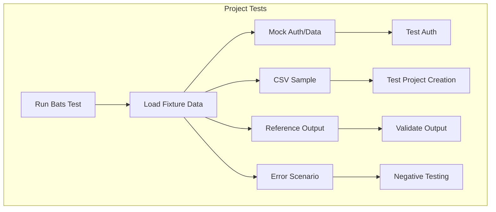

# Test Fixtures

This directory contains test fixtures and sample data files used by the project tests in the parent directory.



## Purpose

Test fixtures provide:

- Sample CSV files for testing project creation and management
- Mock data for authentication and access control testing
- Reference files for validation and comparison
- Test scenarios for edge cases and error conditions

## Usage

These fixtures are automatically used by the test suite when running:

```bash
# Run all project tests (uses fixtures automatically)
bats ../

# Run specific tests that use fixtures
bats ../test-client-delivery-project-csv.bats
bats ../test-product-dev-project-csv.bats
bats ../test-update-projects.bats
```

## File Structure

The fixtures directory contains:

- **CSV files**: Sample project settings and field definitions
- **Mock data**: Authentication tokens and user data (sanitized)
- **Reference files**: Expected output for comparison tests
- **Error scenarios**: Invalid data for negative testing

## Maintenance

When adding new project features or tests:

1. Add corresponding fixture files for new test scenarios
2. Ensure fixture data is realistic but sanitized
3. Update test files to reference new fixtures
4. Document any special requirements or constraints

## Security

All fixture files contain only mock/sanitized data. No real credentials, tokens, or sensitive information should be stored here.

---

## References

- [Project Tests README](../README.md)
- [Main Tests README](../../README.md)
- [Frontmatter Schema](../../../schemas/frontmatter.schema.json)
- [YAML Documentation](../../../docs/YAML.md)
- [Frontmatter Schema Documentation](../../../docs/FRONTMATTER-SCHEMA.md)
