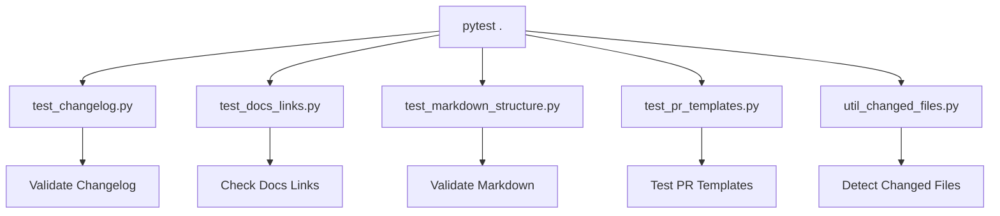

# Python Test Suite

This folder contains Python-based tests and helpers for validating documentation, changelogs, markdown structure, and PR templates in the LightSpeed WP scripts repository.



## Test Files

- `test_changelog.py` — Validates changelog format and entries
- `test_docs_links.py` — Checks documentation links
- `test_markdown_structure.py` — Validates markdown structure
- `test_pr_templates.py` — Tests PR template compliance
- `test-hello-world.bats` — Simple hello world Bats test
- `util_changed_files.py` — Utility for changed files detection

## Coverage

- Documentation and changelog validation
- Markdown structure and link checks
- PR template compliance
- Utility functions for repo automation

## Running Tests

```bash
pytest .
```

## Contributing

See [CONTRIBUTING.md](../../CONTRIBUTING.md) for details.

---

## References

- [Main Tests README](../README.md)
- [Root README](../../README.md)
- [Frontmatter Schema](../../../schemas/frontmatter.schema.json)
- [YAML Documentation](../../../docs/YAML.md)
- [Frontmatter Schema Documentation](../../../docs/FRONTMATTER-SCHEMA.md)
