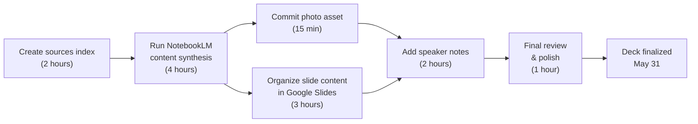

# WCEU 2026 Talk Preparation — Streamlined Planning

**Talk Date**: June 5–6, 2026 (7 days away)
**Slide Deck Due**: May 31, 2026 (48 hours)
**Presentation Format**: 25-minute presentation (24 slides, Google Slides, dark mode)
**Audience**: 200–500 people, theater-style, Q&A at end + Happiness Bar follow-up

---

## Executive Summary

**Current State**:

- ✅ Foundational assets exist (SLIDES_GENERATION_PROMPT, talk outline stub, 20 slide files)
- ⚠️ Missing: Final slide content (all 20 slides), cover/intro/contact/thank-you slides, NotebookLM sources index
- ⏰ **Critical constraint**: 48 hours to finalize

**Strategy**:

- Use existing slide structure + NotebookLM to generate content
- Commit your profile photo to assets
- Create 4 new slides (cover, intro, contact, thank-you)
- Organize NotebookLM sources for content synthesis
- Defer non-blocking work (agents, website, detailed WordPress integration) to post-WCEU

**Timeline**:

- **Today (May 29)**: Planning approved, sources indexed, GitHub issues created
- **Tomorrow (May 30)**: Content generation via NotebookLM, photo committed, slide structure finalized
- **May 31**: Google Slides design pass, speaker notes added, final review
- **June 1–4**: Rehearsal/adjustments
- **June 5–6**: WCEU presentation

---

## Immediate Deliverables (Next 48 Hours)

### 1. Profile Photo Asset

**Owner**: Ash Shaw
**Status**: Pending
**Action**:

- [ ] Commit `wceu-2026/assets/ash-shaw-profile.jpg` to repo
- [ ] Reference in NotebookLM sources (for slide 2: "Meet the Speaker")

### 2. NotebookLM Sources Index

**Owner**: Claude
**Status**: To be created
**Deliverable**: `wceu-2026/notebooklm/sources-index.md`
**Contents**:

- All develop-branch URLs (one per line, 400+ max)
- Organized by category: Foundation, Architecture, Plugins, Talk-Specific, WordPress Integration
- Ready to paste into NotebookLM session

**Categories & Sources**:

```
# FOUNDATION & GOVERNANCE
https://github.com/lightspeedwp/.github/blob/develop/README.md
https://github.com/lightspeedwp/.github/blob/develop/AGENTS.md
https://github.com/lightspeedwp/.github/blob/develop/CLAUDE.md
https://github.com/lightspeedwp/.github/blob/develop/.github/ISSUE_TEMPLATE/
https://github.com/lightspeedwp/.github/blob/develop/.github/PULL_REQUEST_TEMPLATE.md

# ARCHITECTURE & DESIGN
https://github.com/lightspeedwp/.github/blob/develop/docs/ARCHITECTURE.md
https://github.com/lightspeedwp/.github/blob/develop/docs/AUTOMATION_GOVERNANCE.md
https://github.com/lightspeedwp/.github/blob/develop/docs/PLUGIN_PACK_ROADMAP.md
https://github.com/lightspeedwp/.github/blob/develop/instructions/

# PLUGIN PACK & ADOPTION
https://github.com/lightspeedwp/.github/blob/develop/plugins/README.md
https://github.com/lightspeedwp/.github/blob/develop/plugins/PLUGIN_MANIFEST.json
https://github.com/lightspeedwp/.github/blob/develop/docs/PLUGIN_INSTALLATION_GUIDE.md

# TALK-SPECIFIC ASSETS
https://github.com/lightspeedwp/.github/blob/develop/wceu-2026/talk-outline-25min.md
https://github.com/lightspeedwp/.github/blob/develop/wceu-2026/SLIDES_GENERATION_PROMPT.md
https://github.com/lightspeedwp/.github/blob/develop/wceu-2026/references/
https://github.com/lightspeedwp/.github/blob/develop/wceu-2026/assets/

# WORDPRESS AGENT-SKILLS ALIGNMENT (future)
https://github.com/WordPress/agent-skills (external reference for roadmap docs)
```

### 3. Four New Slides (Cover, Intro, Contact, Thank-You)

**Owner**: Claude (using NotebookLM) + Ash Shaw (design in Google Slides)
**Status**: To be generated
**Slides**:

| Slide | Title | Content Brief | Source |
|-------|-------|---------------|--------|
| 1 | **Cover Slide** | Title: "One .github repo to rule them all" / Subtitle: "From central governance to installable AI-Ops plugins" / By Ash Shaw | SLIDES_GENERATION_PROMPT |
| 2 | **Meet the Speaker** | Photo, bio: Founder of LightSpeedWP.Agency, WordPress contributor, speaker, designer, traveller | New (photo asset) |
| 23 | **Contact Details** | Name, email, website, GitHub org, GitHub talk repo, LinkedIn | User-provided |
| 24 | **Thank You** | Simple closing slide | Standard template |

### 4. Slide Content Generation (20 slides)

**Owner**: NotebookLM → Claude → Ash Shaw
**Status**: Pending
**Process**:

1. Claude creates NotebookLM session with sources index
2. Claude provides NotebookLM-generated slide briefs (key points, talking points, diagram suggestions)
3. Ash Shaw transfers content to Google Slides + applies dark-mode design
4. Add speaker notes to each slide (timing, transitions, key talking points)

---

## Critical Path (What Must Happen)



**Total effort**: ~13 hours over 48 hours (achievable with focus)

---

## Folder Structure (Current + Updates)

```
wceu-2026/
├── README.md ✅
├── PLANNING.md ✨ (NEW — this file)
├── WORDPRESS_INTEGRATION_ROADMAP.md ✨ (NEW — post-WCEU work)
├── SLIDES_GENERATION_PROMPT.md ✅
├── talk-outline-25min.md ⚠️ (stub — use for reference)
├── WCEU_2026_AUDIT_AND_READINESS_PLAN.md ✅
├── assets/
│   ├── ash-shaw-profile.jpg ✨ (NEW — to be committed)
│   ├── style-guide.md ⚠️ (from PPTX analysis)
│   └── google-slides-template.md (design notes)
├── notebooklm/
│   ├── sources-index.md ✨ (NEW — URLs for NotebookLM)
│   ├── deep-research-prompt.md ⚠️ (stub → reference for style)
│   └── source-ingestion-checklist.md ⚠️ (stub → reference)
├── references/
│   ├── repo-source-index.md ✅
│   ├── slide-to-source-mapping.md ✅
│   └── glossary.md ✨ (NEW — LightSpeed, GitHub, AI-ops terms)
├── slides/
│   ├── slide-01-cover.md ✨ (NEW)
│   ├── slide-02-speaker-intro.md ✨ (NEW)
│   ├── slide-03-*.md through slide-22-*.md ✅ (existing, finalize content)
│   ├── slide-23-contact-details.md ✨ (NEW)
│   └── slide-24-thank-you.md ✨ (NEW)
└── website/
    └── (post-WCEU — not blocking)
```

---

## GitHub Issues (Parent + Child)

### Parent Issue: "WCEU 2026 Talk Preparation"

**Status**: Active
**Priority**: Critical
**Due**: May 31, 2026
**Description**: Centralized tracking for finalizing the WordCamp Europe 2026 talk (25-minute presentation, 24 slides, dark-mode Google Slides)

**Acceptance Criteria**:

- ✅ Slide deck finalized in Google Slides (24 slides, dark mode, speaker notes)
- ✅ Profile photo committed to assets
- ✅ NotebookLM sources index created
- ✅ Glossary document created
- ✅ Roadmap slide includes WordPress agent-skills reference
- ✅ All 24 slides reviewed and approved
- ✅ Speaker notes completed (timing, talking points, transitions)

---

### Child Issues (Prioritized)

#### NOW (Next 6 hours)

- **[WCEU-01]** Create NotebookLM sources index (`notebooklm/sources-index.md`)
- **[WCEU-02]** Commit profile photo to assets

#### ASAP (Next 24 hours)

- **[WCEU-03]** Run NotebookLM session: Generate slide briefs for all 24 slides
- **[WCEU-04]** Create glossary (`references/glossary.md`): LightSpeed terms, GitHub basics, AI-ops concepts
- **[WCEU-05]** Create cover slide content (slide 1)
- **[WCEU-06]** Create speaker intro slide (slide 2, with photo)
- **[WCEU-07]** Create contact details slide (slide 23)
- **[WCEU-08]** Create thank-you slide (slide 24)

#### URGENT (24–48 hours)

- **[WCEU-09]** Finalize all 20 content slides (3–22) using NotebookLM briefs
- **[WCEU-10]** Add speaker notes to all 24 slides (timing, key points, transitions)
- **[WCEU-11]** Apply dark-mode design system to all slides (verify WCAG AA/AAA contrast)
- **[WCEU-12]** Add WordPress agent-skills reference to roadmap slide
- **[WCEU-13]** Review & polish all slides (final pass)

---

## What's Deferred (Post-WCEU)

**Not blocking the talk**:

- ❌ 7 agent slide decks (separate from main presentation)
- ❌ Website (awesome-copilot style, ongoing resource)
- ❌ Detailed WordPress integration work (detailed roadmap created now, work happens later)
- ❌ Video editing / distribution plan (VideoPress handles this)
- ❌ Community engagement campaign (post-talk follow-up)

**Why**: These add significant effort and aren't needed for a successful talk. Can be built out after June 6.

---

## Success Criteria

By **May 31, 2026 EOD**:

✅ Google Slides deck with 24 slides (dark mode, speaker notes)
✅ All slides follow WCAG AA/AAA contrast requirements
✅ Profile photo committed to `wceu-2026/assets/`
✅ Glossary document created
✅ NotebookLM sources index created
✅ WordPress integration referenced in roadmap slide
✅ All speaker notes include timing, talking points, transitions
✅ Ready for final rehearsal (June 1–4)

---

## Collaboration Model

| Step | Owner | Tool | Output |
|------|-------|------|--------|
| Plan & organize | Ash Shaw | This document | Approved plan |
| Create sources index | Claude | NotebookLM | `sources-index.md` |
| Generate content briefs | Claude | NotebookLM | Slide briefs (text) |
| Design & layout slides | Ash Shaw | Google Slides | `WCEU_2026_Slides.pptx` |
| Add speaker notes | Ash Shaw | Google Slides | Final deck |
| Review & approve | Ash Shaw | GitHub | Merged to main |

---

## Key Design Decisions (from Q&A)

- **Format**: Google Slides (not Figma/Canva/PowerPoint)
- **Mode**: Dark mode, clean, visual-heavy
- **Tone**: Informative + inspiring + approachable + fun
- **Diagrams**: Flowcharts, architecture, before/after, timelines (no code, no animations)
- **Branding**: LightSpeed colors + WCAG AA/AAA contrast
- **Footer**: Slide number + "WordCamp Europe 2026"
- **Metrics**: Include 80% labeling time savings, 100% consistency across 2 pilot repos
- **GitHub Actions**: Include brief overview (no assumption of prior knowledge)
- **WordPress Integration**: Mention in roadmap slide as "Year 1 Vision" / future milestone

---

## Next Immediate Actions

1. **[Claude]** Create `notebooklm/sources-index.md` with all develop-branch URLs
2. **[Ash Shaw]** Commit profile photo to `wceu-2026/assets/ash-shaw-profile.jpg`
3. **[Claude]** Create GitHub issues (parent + child) in this repo
4. **[Claude]** Run NotebookLM with sources index to generate slide briefs
5. **[Ash Shaw]** Start transferring content to Google Slides + applying design system

---

## Related Documents

- **SLIDES_GENERATION_PROMPT.md** — Comprehensive design guide (reference)
- **WORDPRESS_INTEGRATION_ROADMAP.md** — Post-WCEU integration plan (referenced in talk)
- **WCEU_2026_AUDIT_AND_READINESS_PLAN.md** — Audit findings (historical reference)
- **talk-outline-25min.md** — Talk outline stub (use as reference)

---

## Questions?

- **Slide content unclear?** Reference SLIDES_GENERATION_PROMPT.md or slide-specific .md files
- **Design questions?** Refer to PPTX reference file and style-guide.md (from PPTX analysis)
- **WordPress integration scope?** See WORDPRESS_INTEGRATION_ROADMAP.md
- **NotebookLM workflow?** Use sources-index.md + SLIDES_GENERATION_PROMPT.md as input

---

**Status**: Active
**Last Updated**: 2026-05-29
**Next Review**: 2026-05-30 (12-hour check-in)
