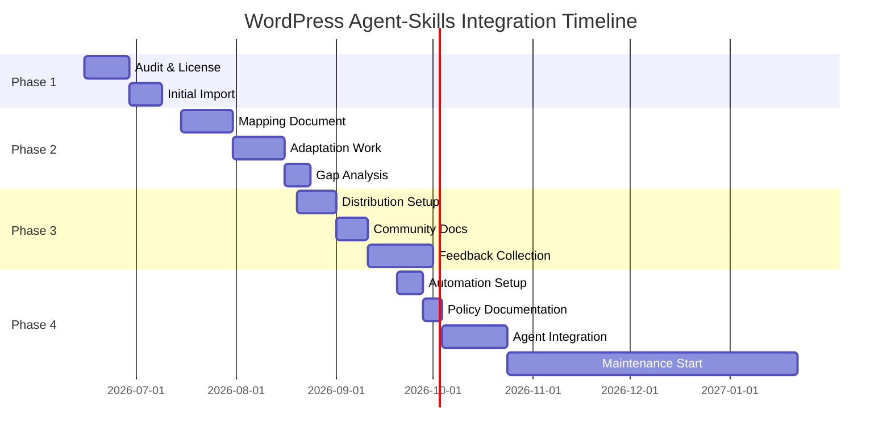

# WordPress Agent-Skills Integration Roadmap

**Vision**: Build on WordPress open-source foundations by integrating WordPress agent-skills into LightSpeed's plugin system, providing a unified knowledge base for AI coding assistants across themes, plugins, and WordPress best practices.

**Timeline**: Post-WCEU (June 2026 onwards)  
**Scope**: Phased integration of WordPress agent-skills into LightSpeed's AI-ops infrastructure  
**Licensing**: GPL 3.0 (compatible with WordPress)  
**Status**: Planning phase (detailed roadmap, work begins post-WCEU)

---

## Executive Summary

### What We're Doing
Integrating expert-level WordPress knowledge from [WordPress/agent-skills](https://github.com/WordPress/agent-skills) repo into LightSpeed's plugin system to:
- Provide AI assistants with authoritative WordPress patterns and best practices
- Leverage WordPress community expertise as foundation for LightSpeed's agent ecosystem
- Enable consistent, high-quality AI-driven code generation and governance across WordPress projects

### Why (Business Case)
- **Leverage existing expertise**: WordPress agent-skills contain proven patterns (blocks, themes, plugins, security, performance)
- **Unified knowledge base**: Combine WordPress patterns + LightSpeed governance into one system
- **Community alignment**: Demonstrate LightSpeed's commitment to WordPress open-source values
- **Reduced duplication**: Avoid re-inventing WordPress knowledge; build on it instead

### How (Approach)
1. **Phase 1** (Jun–Jul 2026): Audit & initial integration
2. **Phase 2** (Jul–Aug 2026): Mapping & adaptation
3. **Phase 3** (Aug–Sep 2026): Distribution & community feedback
4. **Phase 4** (Sep–Dec 2026): Full integration & ongoing maintenance

---

## Current State

### WordPress Agent-Skills Repository
**URL**: [https://github.com/WordPress/agent-skills](https://github.com/WordPress/agent-skills)  
**Structure**: Single monorepo with multiple agent skill definitions  
**Content**: Expert-level knowledge for:
- WordPress block development
- Theme architecture & best practices
- Plugin development & patterns
- WordPress security standards
- Performance & optimization
- Accessibility & WCAG compliance
- Core WordPress patterns

**Stability**: Evolving (not yet fully stable, but comprehensive)  
**Versioning**: Not yet versioned; requires monitoring for breaking changes  
**License**: GPL 3.0 (compatible with LightSpeed's license)

### LightSpeed Current State
- `.github` control plane with plugin system
- 7 specialized agents (release, branding, meta, reviewer, linting, labeling, planner)
- Plugin packs (hooks, workflows, templates, instructions, schemas)
- Target: 400+ develop-branch URLs for NotebookLM ingestion

**Gap**: No direct integration of WordPress patterns into agent-skills layer

---

## Phase 1: Audit & Initial Integration (Jun–Jul 2026)

### Objectives
- [ ] Audit WordPress agent-skills repo structure & content
- [ ] Identify integration points with LightSpeed agents
- [ ] Establish initial import approach (copy files + sync process)
- [ ] Create licensing compliance checklist
- [ ] Document attribution strategy

### Tasks

#### 1.1 WordPress Agent-Skills Audit
**Owner**: Engineering team  
**Effort**: 8–12 hours  
**Deliverable**: `wceu-2026/wordpress-audit.md`

**Audit checklist**:
- [ ] Clone WordPress agent-skills repo locally
- [ ] Analyze repo structure (folders, naming conventions, file types)
- [ ] Identify all agent skill categories
- [ ] Map skill categories to LightSpeed agent types (release, branding, reviewer, etc.)
- [ ] Note any dependencies or cross-skill references
- [ ] Identify skills that fit LightSpeed use cases vs. WordPress-specific-only
- [ ] Document file formats (JSON, YAML, Markdown, etc.)
- [ ] Check for version numbers, deprecation markers, or stability notes

**Questions to answer**:
- How are skills organized? (By feature, role, tool, other?)
- Are there shared utilities or base skills?
- Are there breaking changes or deprecation notices in the repo?
- What's the current test/validation approach?

#### 1.2 Licensing & Attribution Compliance
**Owner**: Ash Shaw + Legal/Compliance  
**Effort**: 4–6 hours  
**Deliverable**: `wceu-2026/LICENSE-and-ATTRIBUTION.md`

**Checklist**:
- [ ] Verify GPL 3.0 license compatibility
- [ ] Create LICENSE file in `.github` repo (if not already present)
- [ ] Document WordPress contributors/authors (for attribution)
- [ ] Add copyright headers to any files copied from WordPress repo
- [ ] Create ATTRIBUTION.md file listing WordPress agent-skills as source
- [ ] Update README.md to mention WordPress agent-skills integration
- [ ] Verify all source files include GPL 3.0 headers

**Compliance notes**:
- GPL 3.0 requires that any modifications be distributed under GPL 3.0
- Attribution required: "Based on WordPress agent-skills"
- If forking, must maintain full license headers
- Derived works must be clearly marked as such

#### 1.3 Integration Approach Decision
**Owner**: Engineering team  
**Effort**: 4–6 hours  
**Deliverable**: Decision document + implementation plan

**Approach options** (ranked by feasibility for LightSpeed):

| Approach | Pros | Cons | Recommended Timeline |
|----------|------|------|----------------------|
| **Copy files + sync process** | Simple, full control, no external dependencies | Maintenance overhead, manual sync | ✅ Phase 1 (start here) |
| **Git submodule** | Auto-updates, clear source link, lightweight | Adds complexity, requires git knowledge | Phase 2 (after proving value) |
| **Package manager (npm/composer)** | Standard dependency management | Requires package publishing, versioning | Phase 3+ (mature approach) |
| **API integration** | Always current, no storage overhead | External dependency, latency concerns | Future consideration |

**Recommendation for Phase 1**:
- **Primary approach**: Copy relevant skill files into `lightspeedwp/.github/plugins/wordpress-agent-skills/` folder
- **Sync strategy**: Set up GitHub Actions workflow to periodically check WordPress repo for updates
- **Manual approval**: Require PR review before syncing updates (ensures quality control)
- **Fallback**: Easy to switch to git submodule in Phase 2 if copying approach becomes cumbersome

#### 1.4 Set Up Initial Import
**Owner**: Claude (automation) + Ash Shaw (review)  
**Effort**: 6–8 hours  
**Deliverable**: Initial copy of WordPress agent-skills into `plugins/wordpress-agent-skills/`

**Folder structure**:
```
lightspeedwp/.github/
├── plugins/
│   ├── wordpress-agent-skills/
│   │   ├── ORIGINAL-SOURCE.md (link to https://github.com/WordPress/agent-skills)
│   │   ├── blocks/
│   │   ├── themes/
│   │   ├── plugins/
│   │   ├── security/
│   │   ├── performance/
│   │   ├── accessibility/
│   │   └── [other categories]
│   │   └── manifest.json (LightSpeed plugin metadata)
```

**Actions**:
- [ ] Clone WordPress agent-skills repo
- [ ] Filter relevant skills (exclude WordPress-specific-only, keep reusable patterns)
- [ ] Copy to `plugins/wordpress-agent-skills/` folder
- [ ] Create `ORIGINAL-SOURCE.md` with link & attribution
- [ ] Create `manifest.json` describing LightSpeed plugin metadata
- [ ] Add to git, commit with proper attribution message

**Commit message template**:
```
feat: Import WordPress agent-skills as LightSpeed plugin pack

Based on: https://github.com/WordPress/agent-skills
License: GPL 3.0
Attribution: [list WordPress contributors if available]

This integration allows LightSpeed agents to leverage WordPress community expertise.
See wceu-2026/WORDPRESS_INTEGRATION_ROADMAP.md for details.
```

---

## Phase 2: Mapping & Adaptation (Jul–Aug 2026)

### Objectives
- [ ] Create mapping document: LightSpeed agents ↔ WordPress agent-skills
- [ ] Adapt WordPress skills to LightSpeed patterns
- [ ] Identify gaps & create new LightSpeed agent skills based on WordPress patterns
- [ ] Establish governance rules for adapted content

### Tasks

#### 2.1 Create Mapping Document
**Owner**: Engineering team  
**Effort**: 12–16 hours  
**Deliverable**: `wceu-2026/WORDPRESS-TO-LIGHTSPEED-MAPPING.md`

**Mapping structure**:
```
## LightSpeed Agent → WordPress Agent-Skills Alignment

### Release Agent
**Purpose**: Semantic versioning, changelog management, release orchestration

**WordPress Skills Aligned**:
- `wordpress-agent-skills/plugins/versioning.md` → Release versioning patterns
- `wordpress-agent-skills/plugins/changelog.md` → Changelog standards
- `wordpress-agent-skills/plugins/release-process.md` → Release checklist patterns

**Adaptation Needed**:
- Generalize WordPress plugin versioning to LightSpeed plugin versioning
- Map WordPress changelog conventions to LightSpeed standard

**Gaps Identified**:
- No guidance on semantic versioning for WordPress themes (opportunity for new LightSpeed skill)

---

### Reviewer Agent
**Purpose**: Code review, security analysis, performance checks

**WordPress Skills Aligned**:
- `wordpress-agent-skills/security/code-injection-prevention.md` → Security patterns
- `wordpress-agent-skills/performance/optimization-checklist.md` → Performance review
- `wordpress-agent-skills/accessibility/wcag-compliance.md` → Accessibility review

**Adaptation Needed**:
- Create LightSpeed-specific security review checklist
- Combine WordPress + LightSpeed patterns into unified review framework

...
```

#### 2.2 Adapt WordPress Skills to LightSpeed Patterns
**Owner**: Engineering team  
**Effort**: 16–24 hours  
**Deliverable**: Adapted skill files in `plugins/wordpress-agent-skills-adapted/`

**Adaptation process**:
1. Take WordPress skill (e.g., `wordpress-agent-skills/plugins/versioning.md`)
2. Generalize WordPress-specific language to apply to LightSpeed context
3. Create LightSpeed version (e.g., `plugins/wordpress-agent-skills-adapted/versioning.md`)
4. Cross-reference original source
5. Test with agent prompts to verify effectiveness

**Example adaptation**:
```
# Original (WordPress)
## Plugin Versioning
Use semantic versioning (MAJOR.MINOR.PATCH) for WordPress plugins.
Update `Version:` header in main plugin file.
Bump version in `package.json` for npm distribution.

# Adapted (LightSpeed)
## Plugin Pack Versioning
Use semantic versioning (MAJOR.MINOR.PATCH) for LightSpeed plugin packs.
Update `version` field in `manifest.json`.
Bump version in `package.json` for npm distribution.
Document changes in `CHANGELOG.md`.
```

#### 2.3 Identify Gaps & Plan New Skills
**Owner**: Engineering team  
**Effort**: 8–12 hours  
**Deliverable**: `wceu-2026/NEW-LIGHTSPEED-SKILLS-PLAN.md`

**Process**:
1. Review mapping document (Task 2.1)
2. Identify features in WordPress skills that don't have LightSpeed equivalents
3. Identify LightSpeed features that have no WordPress equivalent
4. Prioritize new skills to create

**Example gaps**:
- WordPress has guidance on block development; LightSpeed has no equivalent (opportunity to create skill)
- WordPress has theme-specific patterns; LightSpeed agents don't address themes (separate from plugins)
- LightSpeed has infrastructure skills (hooks, workflows) that WordPress doesn't explicitly cover

---

## Phase 3: Distribution & Community Feedback (Aug–Sep 2026)

### Objectives
- [ ] Package integrated skills for distribution (npm, composer, GitHub)
- [ ] Create documentation for using WordPress-aligned agent-skills
- [ ] Collect community feedback via GitHub Discussions
- [ ] Iterate on mapping & adaptations based on feedback

### Tasks

#### 3.1 Create Distribution Packages
**Owner**: DevOps team  
**Effort**: 8–12 hours  
**Deliverable**: Published npm/composer packages, GitHub releases

**Packages to create**:
- `@lightspeedwp/agent-skills-wordpress` (npm)
- `lightspeedwp/agent-skills-wordpress` (composer)
- GitHub Release with full plugin pack

**Package.json example**:
```json
{
  "name": "@lightspeedwp/agent-skills-wordpress",
  "version": "1.0.0",
  "description": "WordPress agent-skills integrated into LightSpeed plugin system",
  "license": "GPL-3.0",
  "repository": "lightspeedwp/.github",
  "keywords": ["wordpress", "agent-skills", "ai-ops", "governance"],
  "peerDependencies": {
    "@lightspeedwp/plugin-system": "^1.0.0"
  }
}
```

#### 3.2 Community Documentation
**Owner**: Ash Shaw + Technical Writer  
**Effort**: 8–10 hours  
**Deliverable**: `docs/WORDPRESS-INTEGRATION-GUIDE.md`

**Sections**:
- What is WordPress agent-skills integration?
- How to install & enable WordPress-aligned skills
- Mapping reference (LightSpeed agents ↔ WordPress skills)
- Examples: Using WordPress block knowledge in LightSpeed agents
- Attribution & licensing information
- FAQ

#### 3.3 Gather Community Feedback
**Owner**: Ash Shaw (facilitation) + Engineering team (review)  
**Effort**: 4–6 hours (initial setup)  
**Deliverable**: GitHub Discussions thread, feedback summary

**Process**:
- Create GitHub Discussion: "WordPress Agent-Skills Integration — Feedback Welcome"
- Invite WordPress community, LightSpeed users, agency partners
- Gather feedback on:
  - Usefulness of integration
  - Gaps or missing patterns
  - Improvements to mapping/adaptation
  - New skills to prioritize
- Document feedback in shared doc
- Prioritize follow-up work

---

## Phase 4: Full Integration & Maintenance (Sep–Dec 2026)

### Objectives
- [ ] Establish automated sync process with WordPress repo
- [ ] Create versioning & deprecation policy
- [ ] Build agent-level integration (teach agents to use WordPress skills)
- [ ] Establish ongoing maintenance cadence

### Tasks

#### 4.1 Automate Sync with WordPress Repo
**Owner**: DevOps team  
**Effort**: 6–8 hours  
**Deliverable**: GitHub Actions workflow, sync documentation

**Workflow**:
1. Weekly check: Compare WordPress repo version with LightSpeed copy
2. If changes detected: Create automated PR with diff
3. Code review: Team reviews changes for compatibility
4. Merge: Update LightSpeed version
5. Notify: Announce updates to community

**Workflow YAML** (template):
```yaml
name: Sync WordPress Agent-Skills
on:
  schedule:
    - cron: '0 9 * * 1'  # Weekly on Monday
jobs:
  sync:
    runs-on: ubuntu-latest
    steps:
      - uses: actions/checkout@v3
      - name: Check WordPress repo for updates
        run: |
          # Clone WordPress repo, compare, create PR if changes detected
          # (implementation details)
      - name: Create Pull Request
        uses: peter-evans/create-pull-request@v4
        with:
          title: 'chore: Sync WordPress agent-skills updates'
          # ...
```

#### 4.2 Versioning & Deprecation Policy
**Owner**: Ash Shaw + Engineering team  
**Effort**: 4–6 hours  
**Deliverable**: `docs/WORDPRESS-SKILLS-VERSIONING-POLICY.md`

**Policy covers**:
- How LightSpeed versions WordPress agent-skills (semantic versioning)
- Breaking change policy (what triggers major version bump)
- Deprecation timeline (how long old versions are supported)
- How to report breaking changes to community
- Rollback procedures

**Example**:
```
## Versioning Policy

- LightSpeed WordPress agent-skills uses semantic versioning: MAJOR.MINOR.PATCH
- MAJOR: Breaking changes (incompatible adaptations, removed skills)
- MINOR: New skills, non-breaking changes
- PATCH: Bug fixes, documentation updates

## Deprecation Timeline

- Major breaking changes: 6-month notice period
- 3 months: Deprecated version still supported
- 6 months: Support ends, users must upgrade
```

#### 4.3 Agent-Level Integration
**Owner**: Engineering team  
**Effort**: 16–24 hours (ongoing)  
**Deliverable**: Updated agent prompts, integration tests

**Work**:
- Update Release Agent prompt to leverage WordPress versioning patterns
- Update Reviewer Agent prompt to use WordPress security/performance checks
- Update Branding Agent prompt to enforce WordPress standards where applicable
- Create integration tests to verify agents use WordPress skills effectively
- Document best practices for agent developers

#### 4.4 Ongoing Maintenance
**Owner**: TBD (rotating team responsibility)  
**Effort**: 4–8 hours/month  
**Cadence**: Monthly review, weekly automated sync

**Maintenance tasks**:
- Monitor WordPress agent-skills repo for major updates
- Review & merge weekly sync PRs
- Update mapping document if significant changes occur
- Respond to community feedback & questions
- Patch LightSpeed skills if WordPress patterns change
- Publish release notes when publishing new versions

---

## Success Criteria

### Phase 1 (Audit & Initial Integration)
- ✅ WordPress agent-skills audited & documented
- ✅ Licensing & attribution compliance established
- ✅ Initial copy of WordPress skills integrated into `plugins/wordpress-agent-skills/`
- ✅ GPL 3.0 attribution in place
- ✅ Roadmap referenced in WCEU 2026 talk

### Phase 2 (Mapping & Adaptation)
- ✅ Mapping document complete (LightSpeed agents ↔ WordPress skills)
- ✅ All WordPress skills adapted to LightSpeed patterns
- ✅ Gaps identified & prioritized for new skills
- ✅ Plan for new LightSpeed skills created

### Phase 3 (Distribution & Community Feedback)
- ✅ npm/composer packages published
- ✅ Community documentation written
- ✅ GitHub Discussions thread active with feedback
- ✅ Initial feedback incorporated into improvements

### Phase 4 (Full Integration & Maintenance)
- ✅ Automated sync workflow in place
- ✅ Versioning & deprecation policy documented
- ✅ Agent prompts updated to use WordPress skills
- ✅ Integration tests passing
- ✅ Maintenance cadence established
- ✅ Community contributions being accepted

---

## Timeline & Dependencies



---

## Resource Requirements

### Team Roles
- **Engineering Lead**: Oversee phases, architecture decisions
- **DevOps Engineer**: Setup automation, package publishing
- **Technical Writer**: Documentation, community guides
- **QA/Tester**: Validation, integration testing
- **Community Manager**: Feedback collection, outreach

### External Dependencies
- WordPress agent-skills repo (GitHub)
- npm registry (package publishing)
- Composer repository (package publishing)
- GitHub Discussions (community feedback)

### Estimated Total Effort
- Phase 1: ~20–26 hours
- Phase 2: ~36–52 hours
- Phase 3: ~20–28 hours
- Phase 4: ~30–46 hours (initial setup) + 4–8 hours/month (ongoing)
- **Total**: ~106–152 hours over 6 months + ongoing maintenance

---

## Risk Assessment

| Risk | Impact | Probability | Mitigation |
|------|--------|-------------|-----------|
| **WordPress repo breaks compatibility** | High | Medium | Monitor repo regularly, establish deprecation policy |
| **Licensing compliance issues** | High | Low | Verify GPL 3.0 early, add legal review step |
| **Low community adoption** | Medium | Medium | Start with Phase 3 community outreach, gather feedback early |
| **Integration complexity** | Medium | Medium | Start simple (copy files), iterate to more complex approaches |
| **Maintenance overhead grows** | Medium | High | Automate sync, document processes, rotate team responsibility |

---

## Attribution & Licensing

**Source**: [WordPress/agent-skills](https://github.com/WordPress/agent-skills)  
**License**: GPL 3.0  
**Attribution**: This work is based on WordPress agent-skills, a project of the WordPress community.  
**Contributors**: [To be completed after audit]

**License Headers** (to be added to copied files):
```
This file is based on WordPress agent-skills.
Source: https://github.com/WordPress/agent-skills
License: GPL-3.0-or-later
Copyright: [WordPress contributors]
Adapted by: LightSpeed (lightspeedwp/.github)
```

---

## Next Steps

1. **Immediate (Before WCEU talk)**: 
   - ✅ Create this roadmap
   - ✅ Reference in WCEU 2026 talk (roadmap slide)
   - ✅ Share with team for visibility

2. **Post-WCEU (June 15+)**:
   - [ ] Schedule Phase 1 kickoff meeting
   - [ ] Begin WordPress repo audit
   - [ ] Draft licensing compliance checklist
   - [ ] Start Phase 1 work

3. **Ongoing**:
   - [ ] Monitor WordPress agent-skills repo for major updates
   - [ ] Update this roadmap quarterly
   - [ ] Share progress in quarterly retrospectives

---

**Status**: Planning (awaiting Phase 1 kickoff)  
**Last Updated**: 2026-05-29  
**Next Review**: 2026-06-15 (Post-WCEU phase kickoff)  
**Responsible Team**: Engineering + DevOps  
**Contact**: [TBD — assign after WCEU]
