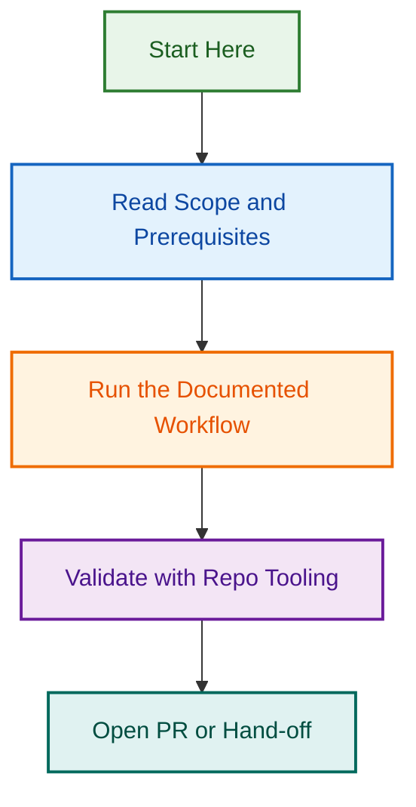

---
authors:
- LightSpeed Team
description: Ownership index for portable agentic workflows, distinct from GitHub Actions, for AI-driven task orchestration.
domain: governance
file_type: documentation
last_updated: "2026-08-19"
license: GPL-3.0
maintainer: LightSpeed Team
stability: stable
tags:
- workflows
- agentic
- ai-ops
- orchestration
title: Portable Agentic Workflows
version: v0.3.2
---

# Portable Agentic Workflows

This folder contains reusable agentic workflows—multi-step, AI-driven processes that orchestrate agents, skills, and manual steps to solve complex problems. These workflows are distinct from GitHub Actions (which are platform-specific automation) and focus on AI orchestration.

## Overview

Agentic workflows define:

- **Process Steps** – Sequential or parallel steps in a workflow
- **Agent Choreography** – Which agents to use and when
- **Branching Logic** – Conditional paths based on results
- **Error Handling** – Recovery strategies for failures
- **Success Criteria** – How to determine when a workflow succeeds

Each workflow is documented with:

- **Purpose** – What problem the workflow solves
- **When to Use** – When to trigger this workflow
- **Inputs** – What data the workflow needs
- **Outputs** – What the workflow produces
- **Time Estimate** – How long it typically takes
- **Examples** – Real-world usage scenarios

## Available Workflows

| Workflow | Purpose | Duration |
|----------|---------|----------|
| [WordPress Project Onboarding](../docs/WORKFLOW_COORDINATION.md) | Set up a new WordPress project with all LightSpeed standards | 2-3 hours |
| [WordPress Spec to Implementation](./wordpress-spec-to-implementation.md) | Convert WordPress PRD into working code with testing | 4-8 hours |
| [Portable AI Plugin Restructure](./portable-ai-plugin-restructure.md) | Reorganise and port AI plugins to new structure | 6-10 hours |
| [Release Readiness Validation](./release-readiness-validation.md) | Validate a project is ready for release | 1-2 hours |
| [Weekly Governance Sync](./weekly-governance-sync.md) | Weekly synchronisation of governance across projects | 1 hour |

## Workflow Format

Each workflow document includes:

```markdown
---
title: "Workflow Name"
description: "What this workflow accomplishes"
version: "v1.0"
last_updated: "2026-05-29"
duration: "2-4 hours"
---

# Workflow Name

## Purpose
[Clear statement of what this workflow achieves]

## When to Use
[When this workflow is appropriate]

## Prerequisites
[What needs to be in place before starting]

## Workflow Steps

### Phase 1: [Phase Name]
1. [Agent/step 1]
2. [Agent/step 2]

### Phase 2: [Phase Name]
[Continue with additional phases]

## Success Criteria
[How to verify the workflow completed successfully]

## Error Recovery
[What to do if something fails]

## Time Estimate
[How long each phase typically takes]

## Examples
[Real-world examples of this workflow in use]
```

## Using Workflows

### In Claude Code

Trigger workflows with:

```bash
# Start a workflow interactively
claude code --workflow wordpress-spec-to-implementation

# Or reference in configuration
{
  "workflows": {
    "enabled": true,
    "default": "wordpress-spec-to-implementation"
  }
}
```

### In GitHub Actions

Chain agentic workflows with GitHub Actions:

```yaml
name: New Project Setup

on:
  issue:
    types: [opened]

jobs:
  setup:
    runs-on: ubuntu-latest
    steps:
      - uses: lightspeedwp/.github/workflows/wordpress-project-onboarding@main
        with:
          project_name: ${{ github.event.issue.title }}
          repository: ${{ github.repository }}
```

### In Projects

Configure workflows in `.claude/settings.json`:

```json
{
  "workflows": {
    "enabled": true,
    "available": [
      "wordpress-project-onboarding",
      "wordpress-spec-to-implementation"
    ]
  }
}
```

## Creating New Workflows

To create a new agentic workflow:

1. Identify the problem and success criteria
2. Map out the steps (agent calls, manual steps, decision points)
3. Document each phase with clear instructions
4. Include error handling and recovery strategies
5. Add at least one real-world example
6. Write tests to validate the workflow
7. Submit PR for review

### Workflow Development Checklist

- [ ] Purpose clearly defined
- [ ] Prerequisites documented
- [ ] Each phase has 2-5 steps
- [ ] Decision points have clear branching logic
- [ ] Error handling for each critical step
- [ ] Success criteria defined
- [ ] Time estimates realistic
- [ ] At least one complete example included
- [ ] Workflow tested end-to-end
- [ ] Cross-checked with related workflows

## Workflow Testing

Before publishing a workflow:

1. **Manual Test** – Walk through the workflow yourself
2. **Agent Validation** – Verify all agents can execute their steps
3. **Error Scenarios** – Test error handling and recovery
4. **Time Validation** – Verify time estimates
5. **Documentation Review** – Check all instructions are clear

## Workflow Versions

Workflows use semantic versioning:

- **Major** (v1 → v2) – Breaking changes to inputs or output
- **Minor** (v1.0 → v1.1) – New optional features or agents
- **Patch** (v1.0.0 → v1.0.1) – Bug fixes, clarifications

## Related Documentation

- [WORKFLOW_COORDINATION.md](../docs/WORKFLOW_COORDINATION.md) – Workflow architecture documentation
- [agents/](../agents/README.md) – Available agents
- [skills/](../skills/README.md) – Available skills
- [AGENTS.md](../AGENTS.md) – Global AI rules
- [CONTRIBUTING.md](../CONTRIBUTING.md) – Contribution guidelines

## Best Practices

- **Keep workflows focused** – One clear outcome per workflow
- **Document thoroughly** – Include examples and decision points
- **Plan for failure** – Every critical step needs error handling
- **Estimate realistically** – Include time for reviews and iterations
- **Test completely** – Verify all paths before publishing
- **Version carefully** – Use semantic versioning for clarity

---

---

*🎼 Orchestrated automation — where intelligence meets operations*
## Visual Workflow


